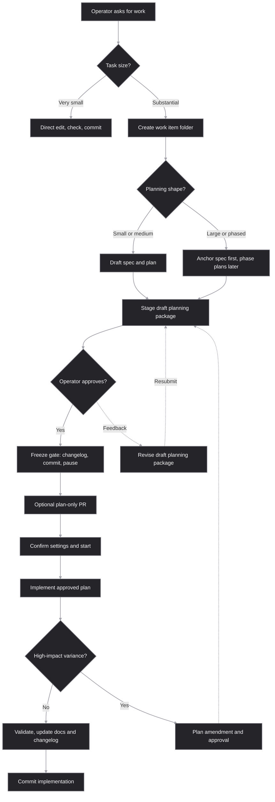

# Dev Doc Harness

Dev Doc Harness is a small, repository-local process harness for making
agent-assisted software work easier to review, pause, resume, and hand off. It
turns planning, approval, implementation variance, and documentation updates
into versioned repository artifacts instead of leaving them only in chat
history.

This repository contains a lightweight documentation harness for agent-assisted
development. Its job is to make the development process more inspectable,
reviewable, and durable from the operator's point of view.

The harness does not replace Superpowers, spec-kit, test-driven development, or
normal engineering judgment. It gives those workflows a repository-local
contract for where planning artifacts live, when planning freezes, and what must
be preserved for future agents or future threads.

The current harness is organized around a small ownership map. `AGENTS.md`
bootstraps the harness and selects repository-specific defaults,
`.agents/skills/dev-doc-harness/SKILL.md` routes common operations, canonical
references own reusable policy, templates own artifact shape, and this README is
only the operator-facing overview.



## What changes for operators

With this harness installed, substantial development work becomes more explicit
before code changes begin.

For very small mechanical edits, little changes. The agent can usually make the
edit directly, preserve behavior, and run the relevant checks.

For small or medium substantial work, expect the agent to create a work item
package at `<work-item-path>`. This applies to features, bug fixes with
nontrivial investigation, prior issue investigations that turn into changes,
refactors, migrations, and documentation/process changes. That folder captures
the spec, plan, required documentation updates, and any implementation variance.
The operator gets a stable place to review what is about to happen before the
agent starts changing the product.

The specification package separates five readable entities. Goal and Scope frame `SPEC-NNN` Specification Commitments; mapped `DEC-NNN` Architecture Decisions realize or constrain those commitments; and `VER-NNN` Verification Criteria define conformance without procedures. The integrated Plan then derives `TASK-NNN` Implementation Tasks from commitments and decisions, and `CHECK-NNN` Plan Checks from criteria. Architecture Decisions do not form a linear layer between commitments and criteria.

```text
Specification Package: Goal/Scope -> SPEC -> VER
                                 DEC -.realizes or constrains.-> SPEC
Integrated Plan:        SPEC + DEC -> TASK    VER -> CHECK
Conformance:            CHECK -> evidence -> VER status -> SPEC conformance
```

Task completion does not establish conformance without check evidence, and passing checks does not complete delivery while required tasks or authorized dispositions remain unresolved. Plan approval and freeze remain separate lifecycle decisions.

The practical small/medium boundary is whether one orchestration thread can
safely coordinate the work with bounded delegation. That coordinating thread
must be able to hold the scope, decisions, validation, variance, final
integration, and completion report without needing another layer of planning.
This is similar only as an analogy to the Scrum Guide's Sprint Planning
readiness idea: a Product Backlog item is ready when it can be completed within
one Sprint, while a harness work item is small/medium-ready when it can be
coordinated by one orchestration thread. The harness is not adopting Scrum
roles, events, or commitments.

The work item folder keeps the full dated ID for sorting and uniqueness, while
the durable artifact filenames include a shorter suffix for easier chat
references. For example, `2026-05-31_artifact-root` uses
`spec_artifact-root.md` and `plan_artifact-root.md`. The exact naming grammar
lives in `references/naming-conventions.md`.

For large or phased work, expect a more deliberate handoff. The agent first
writes an anchor `<spec-filename>` that preserves goals, boundaries, decisions,
risks, tests, Verification Criteria, and phase objectives. Use this path when the
whole effort would saturate one orchestration thread, when bounded delegation is
not enough to keep integration and review clear, or when staged review
materially reduces risk. The normal first planning package is anchor-spec-only;
listed phase-plan filenames are future outputs unless the operator explicitly
asks for combined planning. After the anchor spec is frozen and the operator
gives a fresh instruction, the agent drafts phase plans named with
`<phase-plan-filename>` that a fresh agent or future thread can execute without
relying on hidden chat history.

Work-item architecture decisions are part of the planning package. When a work
item makes or depends on consequential boundaries or tradeoffs, the spec records
them and may use `snapshots/architecture.snapshot.md` as a frozen decision
snapshot. Plans reference that architecture input for sequencing and validation;
they are not the place to silently invent new architectural direction. Durable
repository-level architecture documents such as `ARCHITECTURE.md` are future work
for a separate harness extension.

Durable artifact readability is routed separately from durable completeness.
Routine small/medium artifacts use the baseline readability cues in the quality
reference and templates. Large anchor specs, and any artifact that becomes large
or hard to scan, load `module:artifact-style` for final artifact content,
scannable structure, placeholder control, traceability density, and template
prompt style.

When durable planning artifacts are ready for review, the agent stages the draft
planning package without committing it and asks the operator for approval or
feedback. Explicit approval runs the freeze gate: changelog source fragment,
approval commit, reported artifact paths, and a pause before implementation. The
next operator response can confirm execution settings and authorize
implementation in one step, giving the operator a clean plan-only review point
before product changes.

Model strategy records Model generation, Capability tier, Reasoning effort,
Orchestration mode, resolved profile, and availability/fallback independently.
The durable tiers are `flagship`, `balanced`, and `fast/economy`; current
provider names are mappings, not permanent policy labels. Platform
multi-agent/`ultra` is an orchestration mode, while bounded sub-agents retain
explicit roles, curated context, outputs, and review boundaries. The active
repository policy is selected in `AGENTS.md`; recommendation, harness
authorization, runtime permission, and platform availability remain separate
under `references/subagent-model-policy.md`.

For substantial work, the agent records either a bounded sub-agent strategy or
a reason for using none, then reports de-facto execution at completion. The
strategy also records execution continuity, context visibility, and artifact
rehydration. Prefer a fresh task with a minimal curated-artifact handoff when
the main model/profile changes; runtime permission and availability decide
whether the approved strategy or fallback runs. The new task starts through
`rule:execution-quality.execution-thread-start`, loading the frozen package and
beginning at the named activity without repeating discovery.

During implementation, the agent should not quietly rewrite frozen plans to make
reality look tidier. If the work deviates in a meaningful way, the variance is
recorded. If the post-freeze deviation affects architecture, APIs, data,
security, scope, Specification Commitments, Verification Criteria, Plan Checks, or feasibility, the agent must stop for an
amendment and operator approval.

Before commits, the agent updates a work-item-local changelog source fragment
under `docs/work-items/<work-id>/changelog/*.md` with newest-first entries tied
to the current work item, phase, task, or planning decision. Harness commit
subjects are planned during artifact review and follow the naming reference,
including issue-key handling, title normalization, and nonredundant elaboration
snippets synchronized with matching changelog entries.

Root `CHANGELOG.md` remains the consolidated publication view. Run
`python .agents/skills/dev-doc-harness/scripts/consolidate_changelog_fragments.py`
at a project-owned checkpoint such as after merging work branches, before
preparing release notes, before product/application release, or whenever the
project process needs root changelog completeness. The harness owns this
fragment and consolidation contract; downstream applications, packages, and
agentic systems keep their own release processes.

## Operator outcomes

The main benefit is control without constant micromanagement. You get clear
pause points, durable artifacts, and a written trail of what changed and why.

The harness is designed to produce these outcomes:

- Less lost context between planning, implementation, review, and later threads.
- Fewer surprise implementation turns after a planning discussion.
- Cleaner handoffs to fresh agents, reviewers, or future maintainers.
- More useful PRs, including plan-only PRs before expensive implementation.
- Explicit generation, capability-tier, reasoning-effort, orchestration, continuity, fallback, context strategy, and justified sub-agent choices for substantial work.
- De-facto reporting of orchestration mode, runtime permission and availability, fallback use, continuity, sub-agent roles or waves, and observed model details when available.
- A visible record of plan variance instead of silent drift.
- Documentation updates that are tied to the work instead of remembered later.
- A compact audit trail for Architecture Decisions, Plan Checks, Verification Criteria, and risks.

## How to use it

Agents discover this harness through `AGENTS.md`, then load the operation
router:

```text
.agents/skills/dev-doc-harness/SKILL.md
```

The router sends each operation to the minimum useful owner modules:

| Need | Route |
|---|---|
| Work sizing and artifact lifecycle | `module:lifecycle` in `references/artifact-contract.md` |
| Planning review and freeze checkpoints | `module:freeze-gate` in `references/planning-freeze-gates.md` |
| Durable spec and phase-plan quality | `module:quality` in `references/durable-planning-quality.md` |
| Artifact readability and template prompt style | `module:artifact-style` in `references/artifact-style.md` |
| Model and sub-agent strategy | `module:models` in `references/subagent-model-policy.md` |
| Router, ownership map, and rule IDs | `module:architecture` in `references/policy-architecture.md` |
| Release identity, package boundary, and team adoption | `module:release` in `references/release-policy.md` |
| Execution-time quality checks and fresh-task startup | `module:execution-quality`, including `rule:execution-quality.execution-thread-start`, in `references/context-and-quality-gates.md` |

### Using Superpowers With The Harness

For maintainers, Superpowers and this harness are complementary rather than
competing workflows. Superpowers can shape how the agent brainstorms, plans,
tests, executes, reviews, and finishes work. The harness keeps the repository
record stable: the reviewable spec, plan, snapshots, variance records, and
changelog trail still live in the harness work item package.

The user-visible checkpoint is unchanged. Before implementation starts, expect
one canonical planning package under `docs/work-items/<work-id>/`, followed by
the normal harness approval freeze and a fresh instruction to proceed. If a
Superpowers workflow also refers to `docs/superpowers`, those files should be
short pointers to the harness package rather than a second copy of the spec or
plan.

For harness maintenance, agents can run this lightweight local validation check
before commits that change current harness entrypoints, canonical references,
templates, README, or validation artifacts:

```bash
python .agents/skills/dev-doc-harness/scripts/test_harness_policy.py
```

The command checks current harness surfaces, golden traversal evidence, and
release package consistency. The canonical policy owners remain the routed
references, not this README.

Primary planning templates are maintained from ordered source blocks and
explicit assembly manifests:

```text
.agents/skills/dev-doc-harness/assets/templates/blocks/
.agents/skills/dev-doc-harness/assets/templates/assemblies/
.agents/skills/dev-doc-harness/scripts/assemble_templates.py
```

Edit the block files or manifest files first, then regenerate and validate in
one step:

```bash
python .agents/skills/dev-doc-harness/scripts/assemble_templates.py --write
```

Use `--list` to inspect which common, small, large, and phase blocks make up
each published template. Use `--check` for a non-mutating freshness check; the
main harness validator calls that check so stale generated templates fail
validation.

This repository also provides an optional root-local `.githooks/pre-commit`
hook that runs the validator. It is not installed automatically, it does not
write files, and it is outside the copyable distributable package.

There is not an installation script yet. The copyable distributable package is
the root `AGENTS.md` file plus the `.agents/` folder. The package records its
release in `.agents/skills/dev-doc-harness/VERSION`, and package-local release
notes live under `.agents/skills/dev-doc-harness/docs/releases/`. A compact
package-local operator note travels with the package at
`.agents/skills/dev-doc-harness/docs/operator-note.md`.

After checking out this repository, use the harness in either of these ways:

- Copy `AGENTS.md` and the `.agents/` folder into the repository where you want
  to use the harness. If the destination repository already has an `AGENTS.md`,
  merge or append the harness instructions instead of replacing the file.
  Do not copy this repository's `docs/work-items/` folder; downstream projects
  keep their own work-item artifacts. Commit or open a PR for the harness update
  separately from product work, and roll back by reverting that dedicated update.
- Install it globally. Codex can do this for you, or you can manually copy the
  contents of `.agents/skills/dev-doc-harness/` into
  `$HOME\.agents\skills\dev-doc-harness`.

To make sure the skill is reliably discovered and followed, you can also append
compact bootstrap instructions like this to your global `AGENTS.md`:

```md
## Harness activation

**For any repository development work, apply `dev-doc-harness` before implementation.** Use the harness selected by normal precedence: repository-local harness instructions when present, otherwise the installed global `dev-doc-harness`.

For substantial development work, use the selected harness entrypoint as the operation router. The router owns which canonical references, templates, and work-item artifacts to load for work sizing, planning, freeze gates, implementation, variance, changelog source fragments, compatibility, and model/sub-agent notation.

Only a **very small mechanical edit** may skip durable harness artifacts when the routed lifecycle sizing rules allow it. If uncertain, default to using the harness.

Before editing implementation-target files for substantial work, complete the harness planning and freeze flow. After the freeze gate, begin implementation only after a fresh explicit operator instruction.

Treat `dev-doc-harness` as the canonical source for repository artifact location and lifecycle. README summaries and templates do not override canonical harness references.

When Superpowers is active, use Superpowers for its normal methodology and keep the harness as the artifact-location and lifecycle contract. Canonical specs, plans, snapshots, amendments, variance logs, changelog source fragments, and freeze gates remain in the harness work item package. Any `docs/superpowers` files should be pointer stubs only.

When spec-kit is active, use the repository adapter if present, but keep the harness as the artifact-location and lifecycle contract.
```

Operators usually do not need to invoke the internals by hand. Ask for the work
you want, and the agent should classify the size of the task and apply the
harness when it is needed.

Useful operator prompts include:

```text
Plan this as a large bug fix and stop after the freeze gate.
```

```text
Stage the planning package for approval before committing it.
```

```text
Use the harness, but treat this as a small mechanical edit if it qualifies.
```

```text
Preserve this handoff for a future thread before implementation.
```

```text
Create a plan-only PR checkpoint before code changes.
```

## What is inside

The internal machinery is intentionally small:

- `AGENTS.md` bootstraps the harness and selects repository-specific defaults.
- `.agents/skills/dev-doc-harness/SKILL.md` is the operation router.
- `references/policy-architecture.md` defines the module catalog, rule ID
  conventions, content types, dependency direction, and router inputs.
- `references/naming-conventions.md` (`module:naming`) defines work IDs, artifact filenames,
  commit-message grammar, changelog-entry grammar, collision handling, and
  title normalization.
- `references/release-policy.md` defines Dev Doc Harness distribution release
  identity, package boundaries, changelog-derived release notes, compatibility,
  artifact release context, and team adoption flow.
- `references/artifact-contract.md` defines work item artifact layout,
  snapshots, deltas, lifecycle checkpoints, variance handling, changelog source
  fragments, and root changelog consolidation requirements.
- `references/planning-freeze-gates.md` defines the approval-first planning
  workflow.
- `references/durable-planning-quality.md` defines the quality bar for durable
  specs and phase plans plus Specification Commitments, Verification Criteria,
  Plan Checks, asymmetric Plan coverage, and conformance status.
- `references/artifact-style.md` defines final artifact content, full-name entity
  headings, Verification Criterion placement, asymmetric traceability, scannable
  structure, placeholder control, traceability density, and template prompt style.
- `references/subagent-model-policy.md` defines the available sub-agent and
  model policies. The active repository policy is selected in `AGENTS.md`.
- `assets/templates/` contains the reusable spec, plan, amendment, and variance
  templates. The primary spec and plan templates are assembled from
  `assets/templates/blocks/` and `assets/templates/assemblies/`, but the
  published files stay complete Markdown. Templates own artifact shape and
  prompts, not reusable policy.
- `docs/operator-note.md` is a compact package-local usage summary for adopters
  who copy only root `AGENTS.md` plus `.agents/`.
- `docs/releases/` contains package-local release notes that travel with
  `.agents/`.

Read the routed owner documents for the full contract. The README is only the
operator overview and does not override canonical references.

## What this is not

This harness is not a project management system, a replacement for human review,
or a demand that every typo fix gets a spec folder. It is a process guardrail for
work where planning quality, reviewability, future handoff, or implementation
drift matters.

Its best use is to make agentic development feel less like a disappearing chat
transcript and more like a controlled engineering workflow with clear checkpoints
and reusable artifacts.

## Contributing

Planning artifacts for this harness repository's own development are tracked
repository history. Keep them under `docs/work-items/` so future contributors can
review the specs, plans, snapshots, deltas, and variance records that explain
why the harness changed.

Contributions should commit the harness changes themselves, relevant
`docs/work-items/` artifacts, user-facing documentation updates, and the
required changelog source fragment. Root `CHANGELOG.md` is updated when the
operator runs consolidation for the repository checkpoint.
