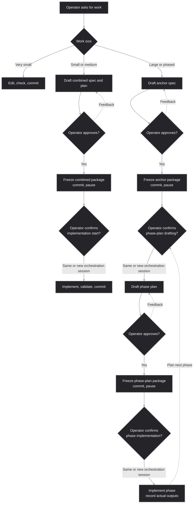

# Dev Doc Harness

Dev Doc Harness is a repository-local contract for agent-assisted development. It turns important planning, approval, verification, and implementation-drift decisions into versioned artifacts instead of leaving them in a chat transcript.

## Why it exists

Agent-assisted work is fast, but a conversation alone is a poor engineering record. Context disappears between threads, planning can blur into unreviewed implementation, and a later agent may not know what was promised, what was verified, or why a design choice was made.

The harness addresses those problems by providing:

- reviewable durable structured planning packages;
- explicit adaptive workflow with pauses between stages;
- deliberate model, reasoning-effort, and orchestration recommendations for each upcoming stage;
- recorded variance or amendments to a plan depending on the extent of material updates;
- work-item-local changelog sources that avoid routine root-changelog merge conflicts;
- one canonical package working together with Superpowers or standalone.

The result is control without constant process micromanagement: operators get a clear record of what will happen, why it changed, and what evidence supports completion.

## Lifecycle at a glance



The frozen package determines the next stage. Small or medium work freezes its combined package, then needs fresh start authorization before implementation. Large/phased work freezes its anchor, then needs a fresh instruction before phase-plan drafting. Each phase plan freezes before its implementation starts; actual phase outputs inform the next phase plan. Feedback always returns to the relevant draft rather than starting the next stage automatically.

## Using the documentation harness

The normal operator experience is intentionally simple: ask for the work you want. Discuss it as needed. The agent sizes the task, loads the relevant harness rules, and presents the required review checkpoint. You do not need to learn a command language to get the benefit.

For example, an ordinary request such as “add import validation” is enough. Use more explicit wording only when you want to set a non-default boundary:

```text
Use the small planning package for this work item.
```

```text
Treat this work as very small mechanical edit, do not create documentation package, but use harness conventions for changelog and commit message.
```

```text
Plan phases 01 and 02 are independent, draft them both in parallel new orchestration sessions and then stop for review before implementation.
```

## Installation

The harness can be installed either on the repository level or globally, as any other skill.

The copyable distributable package is the root `AGENTS.md` file plus the `.agents/` folder. Merge its instructions with an existing destination `AGENTS.md`; do not replace local policy. Do not copy this repository's `docs/work-items/` folder. Keep the adoption in a dedicated commit or PR so you can roll back by reverting that dedicated update.

The copyable package records its version in `.agents/skills/dev-doc-harness/VERSION`. Package-local release notes, a compact downstream guide, and harness release process document travel under `.agents/skills/dev-doc-harness/docs/`. The root README, `CHANGELOG.md`, and repository work-item history are not part of that distribution.

For implementation-stage changelog authoring, follow `module:implementation-changelog` in `references/implementation-changelog.md`. Planning approvals create no fragment; release-stage consolidation remains a project-owned checkpoint.

When merging `AGENTS.md` instructions, copy the full section `## Using Dev Doc Harness` -- or parts of it, according to your preferences and the intended degree to which the harness should be enforced on the respective level, one repository or globally.

An example of a minimalistic bootstrap in the global `AGENTS.md`:

```md
For all development work use the harness router `.agents/skills/dev-doc-harness/SKILL.md`. Very small mechanical edits may proceed without durable artifacts only when the router's `module:lifecycle` sizing rules allow it, and they must still preserve existing behavior and relevant checks.

Use the `economy-default` policy from `.agents/skills/dev-doc-harness/references/subagent-model-policy.md`.

If Superpowers is installed and active, use Superpowers for its normal software-development methodology, but apply this harness as the artifact-location and lifecycle contract. For harness-managed work, this global guidance overrides Superpowers' default spec and plan locations. Keep durable artifacts under `docs/work-items/<work-id>/` in the destination repository.
```

## What operators can rely on

### Planning and conformance

For substantial work, the agent creates a work item under `docs/work-items/<work-id>/`. Small work is the package for bounded, low-risk local work; the operator may explicitly select it, but it must escalate to medium or large/phased before freeze if material architecture, interface, migration, security, or uncertainty appears. Small or medium work drafts and freezes a combined spec-and-plan package together. Large/phased work freezes an anchor spec before later phase plans unless combined planning was explicitly requested.

The practical boundary between medium and large/phased is whether one orchestration session can safely retain scope, decisions, validation, variance, integration, and the user-facing result with bounded delegation. A large/phased package is used when the effort would exceed that boundary, when phase-specific review reduces risk, or when a fresh agent would otherwise need to reconstruct decisions from chat history. Durable filenames use a short suffix for clear chat references; the naming reference owns the exact grammar.

Specs `spec-*` state the agreed outcomes, boundaries, and verification criteria. A spec preserves goals, boundaries, requirements, risks, and relevant decisions. Plans `plan-*` turn the specs into actionable delivery recipes with tasks for step-by-step execution and checks to provide evidence that all verification criteria are covered. The plan records task sequencing, validation, documentation work, planned commit subjects, and the execution strategy.

When a work item makes or depends on consequential tradeoffs, its spec records the work-item architecture and may include `snapshots/architecture.snapshot.md`. Plans consume that input; they do not silently invent architecture. Durable repository-level documents such as `ARCHITECTURE.md` are future work for a separate harness extension.

The planning package also records which supporting documentation artifacts are needed. These can include test-case snapshots, operator, testing, API, or architecture deltas, and required evidence. Frozen specs, plans, snapshots, and amendments remain historical records; later high-impact changes use a new amendment rather than a silent rewrite.

### Review, execution, and handoff

Draft planning artifacts are staged for feedback but not committed. Explicit approval runs the freeze gate: commit the approved package, report its paths, and pause before the next lifecycle stage. This also allows the operator to push and open a draft plan-only PR, and to compact the current orchestration session or start a new one using the provided handoff.

For medium or large/phased work, the applicable planning artifact and its matching chat message show the recommendation for the next stage and its execution mode:
- The next lifecycle stage (for example, plan execution after approval);
- Orchestration (Method, Orchestration mode, `Run in` the same orchestration session or a new one, and stage-appropriate Review);
- Model (generation, capability tier, and reasoning);
- Fallbacks and limits (only those applicable).

A new orchestration session loads the frozen package; a same-session switch rehydrates the frozen package before editing after a model switch or continuity risk.

Execution method defaults to `superpowers:subagent-driven-development`, with fallback to `superpowers:executing-plans` if sub-agents are not available or this method is unsuitable for other reasons, and final fallback to host-native execution if Superpowers is not installed. The handoff also includes recommendations on review sub-agents and their roles, context management strategy for them, and the fallback when the chosen runtime combination is unavailable. Platform-managed multi-agent/`ultra` execution and controlled harness sub-agents are distinct: the latter have named roles, curated context, outputs, and review boundaries. The orchestration session always retains final integration and completion-report ownership.

The operator can override all these recommendations on start authorization.

### Drift, commits, and changelogs

Implementation does not always follow a frozen plan line for line. The harness keeps approved planning artifacts unchanged so reviewers can see what was planned and what was delivered. small implementation or validation adjustments are normal when they preserve the approved scope and outcome. That includes changes that serve the same evidence purpose; using a different command to prove the same result is one example. A change that materially affects the outcome, architecture, API, data, security, privacy, compliance, scope, or required evidence goes through an amendment and approval.

Implementation-stage changelog authoring is governed by `module:implementation-changelog`; it keeps delivery records separate from the root publication view. Release-stage consolidation remains project-owned, while a downstream product/application release keeps its own process.

## Compatibility with other workflows

Superpowers, spec-kit, test-driven development, and engineering judgment remain useful. The harness does not replace them; it owns the repository-local artifact location and lifecycle.

When Superpowers is active, its methodology may guide brainstorming, planning, testing, execution, review, and finishing. The canonical spec, plan, snapshots, variance records, and changelog sources still live in the harness work item. The applicable project-level or merged global `AGENTS.md` preference overrides Superpowers' default spec and plan locations for that work item. The `docs/superpowers` documents are added only when that directory already exists and contains previous documentation packages from before the current work. When allowed, a new file there is only a minimal pointer stub to the canonical package.

The harness distribution policy covers only its own artifacts and changelog contract. Application releases, deployment, and publication remain the downstream repository's responsibility.

The practical Superpowers adapter is straightforward: use its methodology to explore and execute, convert any governing planning content into the canonical work-item package, then run the harness draft-review and approval freeze before implementation. If generic Superpowers defaults conflict, the approved harness plan governs its numbered tasks and meaningful commit boundaries. If a Superpowers workflow would continue directly after planning, the harness pause takes precedence. This preserves one reviewable source of truth and makes the same package available to future threads. After the approved route authorizes execution, Superpowers pre-flight and task aids may remain ephemeral; when it is unavailable, keep each task independently executable and verifiable with the recorded checks.

## For harness maintainers

### Routing

Agents discover the router through `AGENTS.md`:

```text
.agents/skills/dev-doc-harness/SKILL.md
```

It routes work to the minimum useful canonical owner. The common owners are `module:lifecycle` for work-item lifecycle, `module:quality` for durable planning and conformance, `module:freeze-gate` for approval pauses, `module:models` for upcoming-stage orchestration, model selection, sub-agent strategy, review, and integration, `module:release` for distribution, and `module:execution-quality` for execution preflight and execution-session startup.

The agents should use the router rather than load every reference. In particular, it routes evidence-heavy reviews to evidence preservation guidance, large work to the anchor-spec and phase-plan lifecycle, release work to the package-boundary and release-note policy, and template changes to the owning policy plus source blocks and assembly manifests. The router, not this README, is authoritative for the exact required artifacts and validation steps.

The root `AGENTS.md` selects the active repository model policy. Current templates consume that selection, canonical rules own reusable semantics, and templates own field shape rather than duplicating policy. Package maintainers should preserve that ownership boundary when evolving the harness.

For routine orientation, these routes cover most maintenance questions:

| Need | Canonical owner |
|---|---|
| Work sizing, artifacts, and variance | `references/artifact-contract.md` |
| Implementation changelog sources and consolidation | `references/implementation-changelog.md` |
| Approval checkpoints and post-freeze routing | `references/planning-freeze-gates.md` |
| Commitments, criteria, checks, and plan coverage | `references/durable-planning-quality.md` |
| Readability and template prompt style | `references/artifact-style.md` |
| Task orchestration, model selection, and sub-agent strategy | `references/subagent-model-policy.md` |
| Package identity, release notes, and adoption | `references/release-policy.md` |

The naming reference owns work IDs, artifact filenames, and commit subjects; the implementation-changelog module owns current changelog authoring. Evidence-heavy reviews preserve their sources through the evidence module instead of treating mutable live material as a durable record. These owners keep the router small without requiring templates or operator summaries to reproduce long policy sections.

### Releases

Release maintainers use the repository-local release process rather than a generic application-release workflow. The distributable package is root `AGENTS.md` plus `.agents/`; release notes are curated from the consolidated root changelog after work-item fragments have been integrated. A protected post-release PR synchronizes the released state back to `master` before later development branches begin. Downstream adopters can roll back a harness update by reverting its dedicated adoption commit or PR.

Before committing changes to current harness entrypoints, policy, templates, README, or validation artifacts, run:

```bash
python .agents/skills/dev-doc-harness/scripts/test_harness_policy.py
```

Primary planning templates are assembled from `assets/templates/blocks/` and `assets/templates/assemblies/`. Edit source blocks or manifests, then run:

```bash
python .agents/skills/dev-doc-harness/scripts/assemble_templates.py --write
```

Use `--check` for a non-mutating freshness check. The optional root-local `.githooks/pre-commit` hook is a repository development aid; it is not copied with the distributable package.

To consolidate changelog fragments before release, run:

```bash
python .agents/skills/dev-doc-harness/scripts/consolidate_changelog_fragments.py
```

## What this is not

This is not a project-management system, a replacement for human review, or a demand for a spec folder for every typo. It is a guardrail for work where planning quality, handoff, reviewability, or implementation drift matters.

## Contributing

This repository keeps its own planning artifacts under `docs/work-items/` so future contributors can understand why the harness changed. Contributions include the relevant planning package and user-facing updates; implementation-stage changelog work follows `module:implementation-changelog`. Root `CHANGELOG.md` changes only at an operator-owned consolidation checkpoint.
