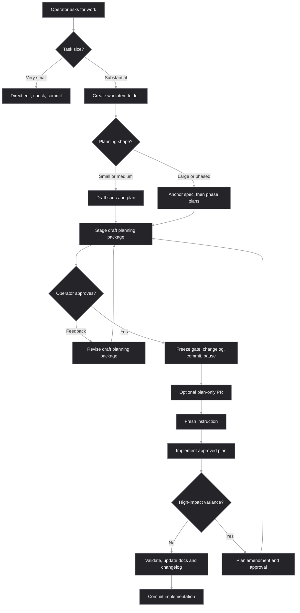

# Dev Doc Harness

This repository contains a lightweight documentation harness for agent-assisted
development. Its job is to make the development process more inspectable,
reviewable, and durable from the operator's point of view.

The harness does not replace Superpowers, spec-kit, test-driven development, or
normal engineering judgment. It gives those workflows a repository-local
contract for where planning artifacts live, when planning freezes, and what must
be preserved for future agents or future threads.



## What changes for operators

With this harness installed, substantial development work becomes more explicit
before code changes begin.

For very small mechanical edits, little changes. The agent can usually make the
edit directly, preserve behavior, and run the relevant checks.

For small or medium substantial work, expect the agent to create a work item
package under `docs/work-items/<work-id>/`. This applies to features, bug fixes with
nontrivial investigation, prior issue investigations that turn into changes,
refactors, migrations, and documentation/process changes. That folder captures
the spec, plan, required documentation updates, and any implementation variance.
The operator gets a stable place to review what is about to happen before the
agent starts changing the product.

The work item folder keeps the full dated ID for sorting and uniqueness, while
the durable artifact filenames include a shorter suffix for easier chat
references. For example, `2026-05-31-artifact-root` uses
`spec-artifact-root.md` and `plan-artifact-root.md`.

For large work, expect a more deliberate handoff. The agent first writes an
anchor `spec-<short-id>.md` that preserves goals, boundaries, decisions, risks,
tests, and acceptance criteria. Then it writes phase plans such as
`plan-phase-01-discovery-<short-id>.md` that a fresh agent or future thread can
execute without relying on hidden chat history.

When durable planning artifacts are ready for review, the agent stages the draft
planning package without committing it and asks the operator for approval or
feedback. Feedback before approval edits the draft artifacts directly; it does
not require an amendment. When the operator explicitly approves, the harness
runs the freeze gate: the agent updates the changelog, commits only the approved
planning artifacts and changelog, reports the commit hash and artifact paths,
and stops before implementation. This gives the operator a clean review point,
including the option to push a planning-only draft PR before any product code
changes.

During implementation, the agent should not quietly rewrite frozen plans to make
reality look tidier. If the work deviates in a meaningful way, the variance is
recorded. If the post-freeze deviation affects architecture, APIs, data,
security, scope, acceptance criteria, or feasibility, the agent must stop for an
amendment and operator approval.

Before commits, the agent updates `CHANGELOG.md` with newest-first entries tied
to the current work item, phase, task, or planning decision.

## Operator outcomes

The main benefit is control without constant micromanagement. You get clear
pause points, durable artifacts, and a written trail of what changed and why.

The harness is designed to produce these outcomes:

- Less lost context between planning, implementation, review, and later threads.
- Fewer surprise implementation turns after a planning discussion.
- Cleaner handoffs to fresh agents, reviewers, or future maintainers.
- More useful PRs, including plan-only PRs before expensive implementation.
- Explicit model, reasoning-effort, and sub-agent choices for substantial work.
- A visible record of plan variance instead of silent drift.
- Documentation updates that are tied to the work instead of remembered later.
- A compact audit trail for decisions, tests, acceptance criteria, and risks.

## How to use it

Agents discover this harness through `AGENTS.md`, then load:

```text
.agents/skills/dev-doc-harness/SKILL.md
```

Operators usually do not need to invoke the internals by hand. Ask for the work
you want, and the agent should classify the size of the task and apply the
harness when it is needed.

Useful operator prompts include:

```text
Plan this as a large bug fix and stop after the freeze gate.
```

```text
Stage the planning package for approval before committing it.
```

```text
Use the harness, but treat this as a small mechanical edit if it qualifies.
```

```text
Preserve this handoff for a future thread before implementation.
```

```text
Create a plan-only PR checkpoint before code changes.
```

## What is inside

The internal machinery is intentionally small:

- `AGENTS.md` tells agents when to use the harness.
- `.agents/skills/dev-doc-harness/SKILL.md` is the entry point.
- `references/artifact-contract.md` defines work item folders, short-ID
  artifact filenames, snapshots, deltas, changelog rules, and variance
  handling.
- `references/planning-freeze-gates.md` defines the approval-first planning
  workflow.
- `references/durable-planning-quality.md` defines the quality bar for durable
  specs and phase plans.
- `references/subagent-model-policy.md` defines the active sub-agent and model
  policy. This repository currently uses `economy-default`.
- `assets/templates/` contains the reusable spec, plan, amendment, and variance
  templates.

Read those documents for the full contract. The README is only the operator
overview.

## What this is not

This harness is not a project management system, a replacement for human review,
or a demand that every typo fix gets a spec folder. It is a process guardrail for
work where planning quality, reviewability, future handoff, or implementation
drift matters.

Its best use is to make agentic development feel less like a disappearing chat
transcript and more like a controlled engineering workflow with clear checkpoints
and reusable artifacts.

## Contributing

Planning artifacts for this harness repository's own development are local
working notes, not distributable project content. Keep them under
`docs/work-items/`, which is ignored by git in this repository.

Contributions should commit the harness changes themselves, any user-facing
documentation updates, and the relevant `CHANGELOG.md` entry, but not local
planning packages for this repo's development.
