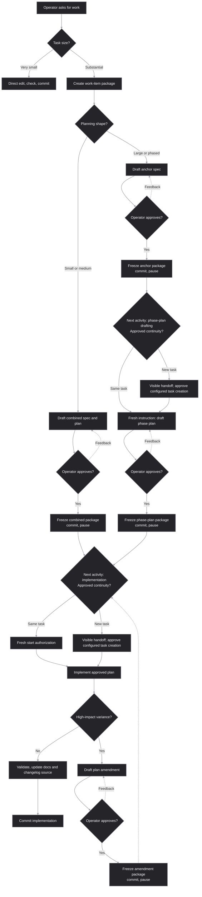

# Dev Doc Harness

Dev Doc Harness is a repository-local contract for agent-assisted development.
It turns important planning, approval, verification, and implementation-drift
decisions into versioned artifacts instead of leaving them in a chat transcript.

## Why it exists

Agent-assisted work is fast, but a conversation alone is a poor engineering
record. Context disappears between threads, planning can blur into unreviewed
implementation, and a later agent may not know what was promised, what was
verified, or why a design choice was made.

The harness addresses those problems by providing:

- reviewable planning packages and explicit pauses before execution;
- a clear distinction between delivery commitments, conformance criteria,
  evidence-producing checks, and actual results;
- durable handoffs for fresh agents and model transitions;
- recorded variance instead of silently rewriting a plan around reality;
- work-item-local changelog sources that avoid routine root-changelog merge
  conflicts; and
- one canonical package when used with Superpowers or spec-kit.

The result is control without constant process micromanagement: operators get a
clear record of what will happen, why it changed, and what evidence supports
completion.

## Lifecycle at a glance



The frozen package, not a generic diagram node, determines the next activity.
A combined small/medium package hands implementation to its plan. A large
anchor package hands later phase-plan drafting to a fresh instruction. A
same-task route needs fresh start authorization; a new-task route displays a
copy-ready handoff and asks separately before creating a task. Neither route
starts implementation automatically.

## Adopt and use it

The normal operator experience is intentionally simple: ask for the work you
want. Discuss it as needed. The agent sizes the task, loads the relevant
harness rules, and presents the required review checkpoint. You do not need to
learn a command language to get the benefit.

For example, an ordinary request such as “add import validation” is enough. Use
more explicit wording only when you want to set a non-default boundary:

```text
Plan this as a large bug fix and stop after the freeze gate.
```

```text
Stage the planning package for approval before committing it.
```

```text
Create a draft plan-only PR checkpoint before code changes.
```

The copyable distributable package is the root `AGENTS.md` file plus the
`.agents/` folder. Merge its instructions with an existing destination
`AGENTS.md`; do not replace local policy. Do not copy this repository's
`docs/work-items/` folder. Keep the adoption in a dedicated commit or PR so
you can roll back by reverting that dedicated update.

The copyable package records its version in
`.agents/skills/dev-doc-harness/VERSION`. Package-local release notes and a
compact downstream guide travel under `.agents/skills/dev-doc-harness/docs/`.
The root README, `CHANGELOG.md`, and repository work-item history are not part
of that distribution.

For ordinary work-item commits, update the matching fragment and run
`python .agents/skills/dev-doc-harness/scripts/consolidate_changelog_fragments.py --lint`.
Fragments may contain multiple newest-first entries, each with its own required
metadata and change body. Root consolidation remains a project-owned checkpoint:
release preparation runs lint followed by `--check`, then uses the default mode
only for an explicit write consolidation.

You can also install the skill globally by copying
`.agents/skills/dev-doc-harness/` into
`$HOME/.agents/skills/dev-doc-harness/`. Use this compact global `AGENTS.md`
bootstrap; copy it only if it fits your own global guidance:

```md
Repository-local harness instructions take precedence. For substantial work, use
the repository's selected harness router. The repository-local harness owns ordinary freeze and changelog details. After its planning freeze and a fresh start
instruction, complete the approved plan; ask before external, destructive,
costly, or material scope-expanding actions.
```

Keep the copied package and product work in separate commits.

## What operators can rely on

### Planning and conformance

For substantial work, the agent creates a work item under
`docs/work-items/<work-id>/`. Small/medium work normally drafts a spec and plan
together; a spec-only freeze is an explicit exception that names plan drafting
as its next activity. Large/phased work freezes an anchor spec before later
phase plans unless combined planning was explicitly requested.

The practical boundary is whether one orchestration thread can safely retain
scope, decisions, validation, variance, integration, and the user-facing result
with bounded delegation. Use a large/phased package when the effort would exceed
that boundary, when phase-specific review reduces risk, or when a fresh agent
would otherwise need to reconstruct decisions from chat history. Durable
filenames use a short suffix for clear chat references; the naming reference
owns the exact grammar.

The specification package separates promise, design, proof, and procedure:

```text
Goal / Scope -> SPEC (Specification Commitment) -> VER (Verification Criterion)
                    DEC (Architecture Decision) -realizes or constrains-> SPEC
Integrated Plan: SPEC + DEC -> TASK (Implementation Task)
                 VER -> CHECK (Plan Check) -> evidence -> VER status
```

Tasks deliver the approved scope; checks produce evidence. Completing tasks
alone does not establish conformance, and passing checks alone does not finish
delivery while required tasks or authorized dispositions remain unresolved.
Planning approval and implementation conformance are distinct decisions.

When a work item makes or depends on consequential tradeoffs, its spec records
the work-item architecture and may include
`snapshots/architecture.snapshot.md`. Plans consume that input; they do not
silently invent architecture. Durable repository-level documents such as
`ARCHITECTURE.md` are future work for a separate harness extension. Large or
hard-to-scan artifacts also load the readability guidance in
`module:artifact-style`.

The planning package also records which supporting documentation artifacts are
needed. These can include test-case snapshots, operator, testing, API, or
architecture deltas, and required evidence. A work item marks each artifact as
required, not applicable, or deferred with an owner and resolving event. Frozen
specs, plans, snapshots, and amendments remain historical records; later
high-impact changes use a new amendment rather than a silent rewrite.

An approved small/medium package normally contains a spec, an implementation
plan, and changelog source fragments. It may also contain architecture and
test-case snapshots, living documentation deltas, an implementation variance
log, and evidence or handoff material. The spec preserves goals, boundaries,
commitments, verification criteria, risks, and relevant decisions. The plan
maps every in-scope commitment to delivery treatment and every applicable
criterion to one or more Plan Checks. It also records task sequencing,
validation, documentation work, planned commit subjects, and the execution
strategy. The exact package shape is intentionally proportional: create only
the supporting artifacts the documentation matrix requires.

### Review, execution, and handoff

Draft planning artifacts are staged for feedback but not committed. Explicit
approval runs the freeze gate: update the matching work-item changelog source,
commit the approved package, report its paths, and pause before the documented
next activity. You may then push and open a draft plan-only PR.

For substantial work, the plan records Model generation, Capability tier,
Reasoning effort, Orchestration mode, resolved profile when exposed, and an
availability fallback. Recommendation, harness authorization, runtime
permission, and platform availability remain separate. A fresh task with a
curated handoff is preferred when the main model or profile changes; a
same-task switch rehydrates the frozen package before editing through
`rule:execution-quality.execution-thread-start`.

The strategy also records whether context usage is exposed, whether artifacts
must be re-read, and the fallback when the chosen runtime combination is
unavailable. Platform-managed multi-agent/`ultra` execution and controlled harness
sub-agents are distinct: the latter have named roles, curated context, outputs,
and review boundaries. The orchestration thread always retains final integration
and completion-report ownership.

### Drift, commits, and changelogs

Frozen plans are not rewritten to make implementation look tidier. An
equivalent implementation or validation adjustment may proceed when it
preserves the approved scope, outcome, and the same evidence purpose. An
amendment and approval are required only when a change materially affects the
outcome, architecture, API, data, security, privacy, compliance, scope, or the
validity of required evidence; using a different command alone is not material
when it proves the same thing.

Before each commit, agents update a work-item-local changelog source fragment
under `docs/work-items/<work-id>/changelog/`. Root `CHANGELOG.md` remains the
curated publication view. Run
`python .agents/skills/dev-doc-harness/scripts/consolidate_changelog_fragments.py`
at a project-owned checkpoint, such as after merging work branches or before
release-note preparation or a product/application release. The harness supplies
this source-and-consolidation contract; downstream projects keep their own
release processes.

## Compatibility with other workflows

Superpowers, spec-kit, test-driven development, and engineering judgment remain
useful. The harness does not replace them; it owns the repository-local artifact
location and lifecycle.

When Superpowers is active, its methodology may guide brainstorming, planning,
testing, execution, review, and finishing. The canonical spec, plan, snapshots,
variance records, and changelog sources still live in the harness work item.
Add `docs/superpowers` documents only when that directory already exists and
contains previous documentation packages from before the current work; never
create or seed it to satisfy compatibility. When allowed, a new file there is
only a minimal pointer stub to the canonical package.

When spec-kit is active, use a repository adapter if present, but treat the
harness router and its references as the source for artifact and documentation
rules.

The harness distribution policy covers only its own artifacts and changelog
contract. Application releases, deployment, and publication remain the
downstream repository's responsibility.

The practical Superpowers adapter is straightforward: use its methodology to
explore and execute, convert any governing planning content into the canonical
work-item package, then run the harness draft-review and approval freeze before
implementation. If a Superpowers workflow would continue directly after
planning, the harness pause takes precedence. This preserves one reviewable
source of truth and makes the same package available to future threads.

## For harness maintainers

Agents discover the router through `AGENTS.md`:

```text
.agents/skills/dev-doc-harness/SKILL.md
```

It routes work to the minimum useful canonical owner. The common owners are
`module:lifecycle` for work-item lifecycle, `module:quality` for durable
planning and conformance, `module:freeze-gate` for approval pauses,
`module:models` for execution strategy, `module:release` for distribution,
and `module:execution-quality` for execution preflight and fresh-task startup.

Use the router rather than loading every reference. In particular, it routes
evidence-heavy reviews to evidence preservation guidance, large work to the
anchor-spec and phase-plan lifecycle, release work to the package-boundary and
release-note policy, and template changes to the owning policy plus source
blocks and assembly manifests. The router, not this README, is authoritative
for the exact required artifacts and validation steps.

The root `AGENTS.md` selects the active repository model policy. Current
templates consume that selection, canonical rules own reusable semantics, and
templates own field shape rather than duplicating policy. Package maintainers
should preserve that ownership boundary when evolving the harness.

For routine orientation, these routes cover most maintenance questions:

| Need | Canonical owner |
|---|---|
| Work sizing, artifacts, variance, changelog sources | `references/artifact-contract.md` |
| Approval checkpoints and post-freeze routing | `references/planning-freeze-gates.md` |
| Commitments, criteria, checks, and plan coverage | `references/durable-planning-quality.md` |
| Readability and template prompt style | `references/artifact-style.md` |
| Model, reasoning, and sub-agent strategy | `references/subagent-model-policy.md` |
| Package identity, release notes, and adoption | `references/release-policy.md` |

The naming reference owns work IDs, artifact filenames, commit subjects, and
changelog-entry grammar. Evidence-heavy reviews preserve their sources through
the evidence module instead of treating mutable live material as a durable
record. These owners keep the router small without requiring templates or
operator summaries to reproduce long policy sections.

Release maintainers use the repository-local release process rather than a
generic application-release workflow. The distributable package is root
`AGENTS.md` plus `.agents/`; release notes are curated from the consolidated
root changelog after work-item fragments have been integrated. A protected
post-release PR synchronizes the released state back to `master` before later
development branches begin. Downstream adopters can roll back a harness update
by reverting its dedicated adoption commit or PR.

Before committing changes to current harness entrypoints, policy, templates,
README, or validation artifacts, run:

```bash
python .agents/skills/dev-doc-harness/scripts/test_harness_policy.py
```

Primary planning templates are assembled from
`assets/templates/blocks/` and `assets/templates/assemblies/`. Edit source
blocks or manifests, then run:

```bash
python .agents/skills/dev-doc-harness/scripts/assemble_templates.py --write
```

Use `--check` for a non-mutating freshness check. The optional root-local
`.githooks/pre-commit` hook is a repository development aid; it is not copied
with the distributable package.

## What this is not

This is not a project-management system, a replacement for human review, or a
demand for a spec folder for every typo. It is a guardrail for work where
planning quality, handoff, reviewability, or implementation drift matters.

## Contributing

This repository keeps its own planning artifacts under `docs/work-items/` so
future contributors can understand why the harness changed. Contributions
include the relevant planning package, user-facing updates, and a matching
changelog source fragment. Root `CHANGELOG.md` changes only at an
operator-owned consolidation checkpoint.
