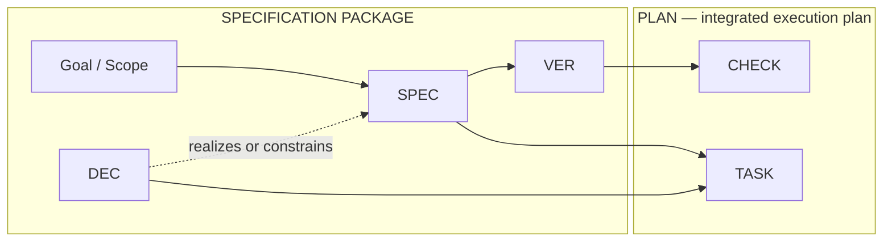

# Commitment Verification Model Architecture Snapshot

Work ID: `2026-07-11_commitment-verification-model`
Short ID: `commitment-verification-model`
Status: Approved
Harness release: `0.5+`
Schema: `schema:snapshot.architecture`
Policy references: `module:architecture`, `module:lifecycle`, `module:quality`, `module:artifact-style`, `module:evidence`, `module:release`, `rule:lifecycle.work-item-architecture-decisions`, `rule:lifecycle.immutable-snapshots`, `rule:lifecycle.variance-policy`, `rule:quality.spec-handoff`, `rule:evidence.preservation`, `rule:release.compatibility`

## Purpose

Preserve the semantic, ownership, topology, traceability, compatibility, and test-architecture decisions that implementation planning and later execution must consume without reconstructing the design conversation.

## Guiding Information-flow Model

The Specification Package contains the spec document and its companion architecture snapshot. It is distinct from the Plan:



Solid arrows show downstream derivation or consumption. The dashed relation means that an Architecture Decision realizes or constrains mapped Specification Commitments without creating independent delivery scope. The Plan integrates two required mappings: Specification Commitments plus applicable decisions derive Implementation Tasks or authorized non-task dispositions, while Verification Criteria derive Plan Checks. Neither path is a complete Plan alone.

Execution closes the conformance loop separately:

```text
DEFINITION        SPEC ───────▶ VER ───────▶ CHECK
                    │            │             │
                    ▼            ▼             ▼
ASSESSMENT       SPEC       ◀── VER       ◀── evidence
               conformance      status
```

Task completion does not establish conformance without the required evidence, and passing checks does not complete delivery while required tasks or dispositions remain unresolved. These relations express authority and traceability, not mandatory Draft authoring chronology.

## Decision Ledger

### `DEC-001` Architecture Decision — Use distinct specification, planning, and conformance flows

Selected approach:

1. Use Specification Commitment (`SPEC`) for normative scope, Architecture Decision (`DEC`) for selected design within mapped scope, Verification Criterion (`VER`) for pass/fail conformance propositions, Implementation Task (`TASK`) for planned work, Plan Check (`CHECK`) for concrete evidence-producing procedures, and execution records for actual results.
2. Treat the specification package and Plan as distinct artifact boundaries: the former supplies commitments, decisions, and criteria; the latter integrates tasks and checks.
3. Treat mutable Draft commitments as proposed, approval-committed commitments as binding for implementation after normal start authorization, and handoff-snapshot commitments as authoritative only for the named downstream planning or review purpose.
4. Keep planning approval/freeze and optional outcome validation or delivery acceptance outside the conformance loop.
5. Do not introduce separate result or evidence ID namespaces in this work item; execution records cite `CHECK` IDs.

Affected boundaries:

1. Repositories: `D:/Code/dev-doc-harness` only.
2. Components or modules: `module:quality`, `module:artifact-style`, lifecycle, release, evidence, and current planning templates.
3. Interfaces, schemas, config, or infra: current `schema:spec.*` and `schema:plan.*` template shapes; schema IDs remain stable.
4. Agentic, process, documentation, or phase boundaries: spec authoring, plan derivation, execution checks, completion reporting, approval, and variance.

Source spec sections:

1. `SPEC-001`, `SPEC-002`, `SPEC-004`, `SPEC-008`, `SPEC-009`, `SPEC-010`, and `SPEC-012`.

Validation cues:

1. `VER-001`, `VER-002`, `VER-004`, `VER-008`, `VER-009`, `VER-010`, `VER-012`, `VER-015`, and `VER-016`.

Rejected alternatives:

1. Retain `REQ` and rename only `AC`: leaves the normative and procedural conflation intact.
2. Add `RESULT` and `EVIDENCE` registries now: adds traceability burden without demonstrated planning value.

### `DEC-002` Architecture Decision — Use self-explaining IDs and orthogonal commitment facets

Selected approach:

1. Use `SPEC-NNN`, `DEC-NNN`, `VER-NNN`, `TASK-NNN`, and `CHECK-NNN` as familiar, pronounceable ID families, with full entity names and short titles in every entity heading.
2. Require one `Kind` from Outcome, Behavior, Quality, Constraint, or Deliverable and one `Intent` from Establish, Change, Preserve, Maintain, or Prevent.
3. Define each Kind and Intent plus a deterministic precedence rule for overlaps.
4. Allow optional concise Concerns for affected surfaces without treating them as a second normative layer.
5. Use full entity names in canonical prose; reserve bare prefixes for IDs, ID-family patterns, and compact diagrams or tables whose surrounding text supplies the full names.

Affected boundaries:

1. Repositories: `D:/Code/dev-doc-harness` only.
2. Components or modules: spec and plan schema blocks, artifact-style guidance, examples, validator fixtures, and authored work-item artifacts.
3. Interfaces, schemas, config, or infra: Markdown heading grammar and commitment block fields.
4. Agentic, process, documentation, or phase boundaries: human scanability, agent classification, search, cross-reference, and later amendments.

Source spec sections:

1. `SPEC-003`, `SPEC-004`, and `SPEC-005`.

Validation cues:

1. `VER-003`, `VER-004`, `VER-005`, and `VER-016`.

Rejected alternatives:

1. `SPECC` / `VERC`: encode more of the full names but are less familiar and harder to pronounce.
2. `SPC` / `VEC`: shorter, but commonly read letter-by-letter or as “vector” and therefore less immediately recognizable.
3. Normative Clause / Verification Criterion: semantically precise but more legalistic and less aligned with the operator's readability goal.
4. A flat type list mixing outcome, interface, preservation, lifecycle, and documentation: classifications overlap and do not reliably guide planning.

### `DEC-003` Architecture Decision — Declare a narrow normative perimeter

Selected approach:

1. Keep every implementation obligation in a Specification Commitment Statement.
2. Make an architecture decision binding only when the canonical `Source spec sections` relation names one or more Specification Commitments and every selected-approach clause is supported by a named Statement.
3. Require every Architecture Decision to realize or constrain mapped commitment scope without adding an independent obligation; route newly discovered obligations through Draft commitment revision or post-freeze amendment.
4. Treat rationale, examples, and clarifications as non-normative.
5. Split clauses when they can be implemented, deferred, waived, amended, or verified separately.
6. Keep behavior-defining scenarios inside commitments and forbid Verification Criteria from enlarging scope or covering DEC-only obligations.

Affected boundaries:

1. Repositories: `D:/Code/dev-doc-harness` only.
2. Components or modules: durable planning quality, spec templates, readiness guidance, variance handling, and skill-behavior tests.
3. Interfaces, schemas, config, or infra: Specification Commitment field contract.
4. Agentic, process, documentation, or phase boundaries: spec review, plan decomposition, change control, and post-freeze amendments.

Source spec sections:

1. `SPEC-004` and `SPEC-006`.

Validation cues:

1. `VER-001`, `VER-004`, `VER-006`, and `VER-014`.

Rejected alternatives:

1. Preserve free-form Notes for binding detail: continues hidden scope and weakens traceability.
2. Attempt automated atomicity or semantic-scope grading: exceeds reliable structural validation.

### `DEC-004` Architecture Decision — Use deterministic hybrid Verification Criterion placement

Selected approach:

1. Define criteria covering one commitment immediately beneath that commitment.
2. Define criteria covering two or more commitments exactly once in a Cross-cutting Verification Criteria section.
3. Make `Covers` required and explicit; derive placement from semantic coverage rather than shared execution procedure.
4. Keep IDs stable across movement and validate unique definitions and valid coverage structurally.
5. Make all applicable criteria and expected-evidence items conjunctive by default, with explicit `Any one of` alternatives and documented applicability overrides.
6. Assign a cross-phase criterion to the phase delivering its final prerequisite, preserve earlier partial evidence, and prohibit premature pass status.

Affected boundaries:

1. Repositories: `D:/Code/dev-doc-harness` only.
2. Components or modules: spec source blocks, generated templates, artifact-style guidance, and validator checks.
3. Interfaces, schemas, config, or infra: Markdown section and heading topology.
4. Agentic, process, documentation, or phase boundaries: local review, large-document navigation, shared criteria, and plan derivation.

Source spec sections:

1. `SPEC-006` and `SPEC-007`.

Validation cues:

1. `VER-006`, `VER-007`, `VER-016`, and `VER-017`.

Rejected alternatives:

1. Fully separate registries: regular for tooling but retains repeated navigation for ordinary review.
2. Fully co-located criteria and checks: duplicates genuine cross-cutting semantics and conflates shared procedures with shared criteria.

### `DEC-005` Architecture Decision — Use asymmetric plan traceability

Selected approach:

1. Map each Specification Commitment to implementation tasks, verification-only treatment, or an exact frozen-spec reference authorizing delivery in a later phase.
2. Prohibit plan-created deferrals; any post-freeze deferral absent from the frozen spec requires an approved amendment.
3. Trace every architecture decision used by a plan through the snapshot's canonical `Source spec sections` relation and consume it under one of the mapped Specification Commitments.
4. Map Verification Criteria to Plan Checks and expected evidence stages.
5. Allow one Plan Check to support several criteria and do not require artificial tasks for preservation-only commitments.
6. Treat the Plan as incomplete unless both the commitment-disposition and verification-execution mappings are covered and coordinated through task/check stages and dependencies.
7. Permit an Implementation Task to trace to an explicit Plan Check enablement need when it creates verification infrastructure, fixtures, or another prerequisite rather than product delivery scope.

Affected boundaries:

1. Repositories: `D:/Code/dev-doc-harness` only.
2. Components or modules: small/medium plan template, phase-plan template, plan readiness, completion reporting, and variance references.
3. Interfaces, schemas, config, or infra: plan traceability tables and `CHECK` block schema.
4. Agentic, process, documentation, or phase boundaries: planning decomposition, check reuse, evidence reporting, and fresh-thread execution.

Source spec sections:

1. `SPEC-002` and `SPEC-008`.

Validation cues:

1. `VER-001`, `VER-002`, `VER-008`, `VER-015`, and `VER-016`.

Rejected alternatives:

1. Keep one matrix mapping every spec entity to tasks and validation: visually complete but semantically collapses the layers.
2. Generate one task per commitment and one check per criterion: creates unnecessary work and prevents useful many-to-many grouping.

### `DEC-006` Architecture Decision — Give Plan Checks stable procedure and execution-record semantics

Selected approach:

1. Require `Covers`, `Procedure`, `Expected result`, `Evidence record`, and `Stage or environment` in every Plan Check.
2. Treat multiple checks as conjunctive by default and require explicit `Any one of` grouping plus an equivalence rationale for alternatives.
3. Use a stable `CHECK` ID for the frozen procedure and separate execution-instance records for repeated runs, environments, results, and evidence locations.
4. Route material procedure changes through approved plan variance or amendment rather than silently reinterpreting the ID.

Affected boundaries:

1. Repositories: `D:/Code/dev-doc-harness` only.
2. Components or modules: plan templates, phase-plan templates, execution-quality guidance, completion reporting, and evidence reports.
3. Interfaces, schemas, config, or infra: Plan Check block fields and execution-record shape.
4. Agentic, process, documentation, or phase boundaries: verification planning, repeated execution, environment coverage, evidence capture, and conformance status.

Source spec sections:

1. `SPEC-002`, `SPEC-008`, and `SPEC-009`.

Validation cues:

1. `VER-002`, `VER-008`, `VER-009`, `VER-015`, and `VER-016`.

Rejected alternatives:

1. Keep a command-only `V` row: cannot distinguish the frozen procedure from repeated execution evidence.
2. Add separate result and evidence ID registries: unnecessary until repeated evidence needs independent cross-artifact identity.

### `DEC-007` Architecture Decision — Preserve stable schema anchors and test the skill behavior-first

Selected approach:

1. Keep stable `schema:*`, `module:*`, and `rule:*` IDs unversioned; use harness release compatibility and discoverable replacement notes when needed.
2. Keep frozen historical artifacts unchanged and outside current-schema enforcement, including pre-release-stamp artifacts governed by their preserved local context.
3. Protect deterministic structure through the current validator and source/generated template checks.
4. Protect semantic behavior through preserved fresh-context RED/GREEN/REFACTOR scenarios and a final high-reasoning review.

Affected boundaries:

1. Repositories: `D:/Code/dev-doc-harness` only.
2. Components or modules: policy architecture, release policy, evidence guidance, validator, template assembly, work-item evidence, and model/sub-agent strategy.
3. Interfaces, schemas, config, or infra: current schema owners, validation check IDs, and evidence report shape.
4. Agentic, process, documentation, or phase boundaries: baseline testing, skill update, forward testing, release compatibility, and rollback.

Source spec sections:

1. `SPEC-011`, `SPEC-012`, `SPEC-013`, `SPEC-014`, `RISK-006`, `RISK-007`, and `RISK-008`.

Validation cues:

1. `VER-011`, `VER-012`, `VER-013`, `VER-014`, and `VER-017`.

Rejected alternatives:

1. Version every schema ID: conflicts with current release policy and adds migration overhead without improving artifact interpretation.
2. Rely only on structural validation: cannot demonstrate that fresh agents understand the semantic distinction.
3. Rely only on reviewer opinion: does not provide repeatable regression evidence.

## Decision Drivers

1. Human reviewers need a local and self-explaining reading path.
2. Planning agents need distinct normative and verification inputs.
3. Genuine many-to-many relationships must remain representable without duplicating criteria or procedures.
4. Current policy and template ownership must remain concise and progressively disclosed.
5. Historical work-item artifacts are immutable snapshots.
6. Skill behavior must be demonstrated rather than inferred from wording alone.

## Constraints

1. Current artifacts remain Markdown-native and grep-friendly.
2. Templates own schema shape but not long reusable policy.
3. Generated templates are modified only through source blocks and assembly manifests.
4. Structural validation remains deterministic and does not judge prose semantics.
5. The active repository policy is `economy-default`; stronger reasoning is justified for plan synthesis and final high-blast-radius review.
6. Platform model identity and exact context visibility are not exposed.

## Future Durable-Doc Boundary

Repository-level durable architecture documents such as `ARCHITECTURE.md` remain outside this work item. No `deltas/architecture-summary.delta.md` is required because the canonical policy modules, templates, and this work-item snapshot are the intended owners.

## Approval

- Status: Approved
- Superseded by: None
