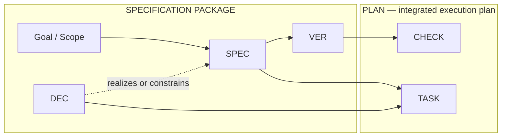

# Commitment Verification Model Spec

Work ID: `2026-07-11_commitment-verification-model`
Short ID: `commitment-verification-model`
Status: Approved
Harness release: `0.5+`
Schema: `schema:spec.small-medium`
Vocabulary profile: Approved `SPEC` / `DEC` / `VER` / `TASK` / `CHECK` design; this frozen spec self-hosts the proposed future current-policy shape before implementation activates it.
Policy references: `module:architecture`, `module:lifecycle`, `module:naming`, `module:quality`, `module:models`, `module:artifact-style`, `module:freeze-gate`, `module:execution-quality`, `module:evidence`, `module:release`, `rule:lifecycle.documentation-matrix`, `rule:lifecycle.commit-message-format`, `rule:lifecycle.work-item-architecture-decisions`, `rule:naming.derived-patterns`, `rule:naming.work-item-paths`, `rule:naming.commit-messages`, `rule:quality.spec-handoff`, `rule:models.strategy-required`, `rule:style.trace-density`, `rule:freeze.approval-freeze`, `rule:execution-quality.execution-thread-start`, `rule:evidence.preservation`, `rule:release.compatibility`

## Goal

Replace the ambiguous Requirements and Acceptance Criteria layers with a human-readable conformance model that separates specification commitments, verification criteria, plan checks, execution evidence, and lifecycle approval while preserving enough structure for agents to derive detailed implementation plans.

## Source and Intent

Source input:

1. The operator identified that `REQ` and `AC` work operationally but have historically loaded and overlapping meanings.
2. The operator asked for terminology and structure optimized for human review, semantic clarity, and implementation-plan derivation by agents.
3. Repository review showed that current `REQ` Notes can contain several independently consequential obligations, current `AC` blocks can mix expected behavior with commands, and the current plan traceability matrix maps both layers identically to tasks and validation.
4. The operator approved a refined hybrid model that separates normative commitments, conformance criteria, concrete checks, and recorded evidence.
5. The operator first selected the explicit identifiers `SPECC`, `VERC`, and `CHECK`, then revised the complete entity set to the familiar `SPEC`, `DEC`, `VER`, `TASK`, and `CHECK` families after confirming that mandatory full names in headings preserve semantic precision.
6. The operator approved a primary information-flow diagram that treats the specification package and Plan as distinct document boundaries, plus a separate conformance loop from definitions through evidence and status.

Desired operator/user outcome:

1. Reviewers can understand what is promised, what demonstrates conformance, and what procedure will produce evidence without interpreting historically ambiguous terminology.
2. Planning agents receive distinct inputs for implementation decomposition and verification execution rather than treating every spec item as both a task source and a test procedure.
3. Large and small artifacts preserve genuine many-to-many verification relationships without forcing ordinary readers to join two distant registries.
4. Existing frozen `REQ` / `AC` artifacts remain valid historical snapshots and require no rewrite or migration sidecar.

Success summary:

1. Current reusable harness policy and templates define `SPEC`, `DEC`, `VER`, `TASK`, and `CHECK` consistently, with their full names visible in every entity heading.
2. Specification authors place normative delivery scope only in Specification Commitments, use mapped Architecture Decisions to realize or constrain that scope, define conformance through Verification Criteria, and defer procedures and actual results to planning and execution.
3. Plan authors derive coordinated Implementation Task and Plan Check content from the complete specification package rather than treating the delivery and verification paths as alternatives.

## Scope Boundary

### In scope

1. Define the information flow from Goal and Scope through the specification package into an integrated Plan, and define the separate conformance loop from Specification Commitment through evidence back to conformance status.
2. Define the exact `SPEC-NNN`, `DEC-NNN`, `VER-NNN`, `TASK-NNN`, and `CHECK-NNN` heading grammar with full entity names and short descriptive titles.
3. Define the normative perimeter, atomicity rule, controlled commitment facets, verification-criterion fields, aggregation defaults, and scope-preservation rule.
4. Define deterministic hybrid placement for local and cross-cutting verification criteria.
5. Replace symmetric requirement/acceptance traceability with separate commitment-disposition and verification-execution mappings in plan and phase-plan templates.
6. Keep spec approval/freeze, conformance verification, and optional outcome validation or delivery acceptance semantically distinct.
7. Update canonical owners, source blocks, generated templates, standalone planning templates, current examples, operator guidance, and structural validator coverage.
8. Preserve stable unversioned `schema:*` anchors and use the harness release compatibility model for current versus historical vocabulary.
9. Use test-driven skill authoring: preserve baseline agent failures, update the minimum guidance needed, and forward-test the revised skill and templates on realistic scenarios.
10. Preserve the current source-block and assembled-template workflow.

### Non-scope

1. Do not rewrite or normalize frozen historical work-item specs, plans, snapshots, amendments, or reports.
2. Do not create automatic migration sidecars for historical `REQ`, `AC`, `V`, or `T` identifiers.
3. Do not ban ordinary lowercase uses of words such as requirement, acceptance, validation, or verification when they are not naming artifact entities.
4. Do not introduce a formal logic engine, proof system, requirements-management database, or third-party tool integration.
5. Do not make the validator grade prose semantics, infer whether a commitment is genuinely atomic, or decide whether evidence is logically sufficient.
6. Do not create separate `RESULT` or `EVIDENCE` ID namespaces in this work item; execution records cite the applicable `CHECK` IDs unless later evidence demonstrates a separate identity is needed.
7. Do not change the approval-freeze authorization sequence, immutable-snapshot policy, or post-freeze variance classes except to align entity names and references.
8. Do not change unrelated artifact IDs such as `RISK` or amendment and variance identifiers; retain the established `DEC` family while adding its mandatory full heading name, and change current task IDs from `T` to `TASK` without rewriting frozen history.
9. Do not optimize terminology around external tooling at the expense of the approved harness-native human and agent workflow.

### Assumptions

1. Familiar, pronounceable ID families plus mandatory full entity names in headings make the model learnable without relying on an acronym glossary or encoding every semantic word in the prefix.
2. Stable IDs and explicit `Covers` metadata are sufficient for Markdown-native traceability when paired with structural validation.
3. `module:quality` is the appropriate canonical owner for commitment, criterion, and plan-check semantics; templates own their concrete schema shape and `module:artifact-style` owns readability guidance.
4. Harness release compatibility is sufficient to distinguish current reusable policy from frozen historical artifacts; stable `schema:*` anchors do not need semantic versions.
5. The current work is a substantial small/medium documentation-process change that one orchestration thread can integrate with bounded read-only sub-agent testing and review.

### Open questions

1. None identified after repository review, critical design scrutiny, and operator approval of the revised identifiers.

## Guiding Information-flow Model

The model is not a linear `DEC -> SPEC -> VER -> CHECK -> TASK` hierarchy. It distinguishes a Specification Package from the Plan and gives each relation one meaning.

The Specification Package consists of the spec document and its companion architecture snapshot. Goal and Scope, Specification Commitments, and Verification Criteria live in the spec. Architecture Decisions live in the snapshot and map back to the commitments they realize or constrain.



Solid arrows show downstream derivation or consumption. The dashed `DEC -> SPEC` arrow is a mapping relation: an Architecture Decision realizes or constrains mapped Specification Commitments but cannot create independent delivery scope.

The first three conceptual columns form the Specification Package:

1. Goal and Scope frame the work.
2. Specification Commitments define normative delivery scope; mapped Architecture Decisions select design within that scope.
3. Verification Criteria define what must be demonstrated for the commitments to conform.

The fourth column is the Plan. It is the enclosing artifact, not another entity in the chain:

1. Specification Commitments plus applicable mapped Architecture Decisions derive Implementation Tasks and authorized non-task dispositions.
2. Verification Criteria derive Plan Checks and expected evidence stages.
3. The Plan coordinates tasks and checks through dependencies, sequencing, ownership, and execution stages.
4. A Plan is incomplete if it covers only the delivery path or only the verification path.

The direct `SPEC -> TASK` relation therefore does not authorize planning to skip `VER -> CHECK`. It states only where delivery work originates. Every in-scope Specification Commitment needs an authorized disposition, every applicable Verification Criterion needs Plan Check coverage, and the Plan must integrate both.

Execution closes a separate conformance loop:

```text
DEFINITION        SPEC ───────▶ VER ───────▶ CHECK
                    │            │             │
                    ▼            ▼             ▼
ASSESSMENT       SPEC       ◀── VER       ◀── evidence
               conformance      status
```

The upper row moves from normative meaning to an evidence-producing procedure. Executing a Plan Check produces evidence; that evidence determines Verification Criterion status; applicable criterion statuses contribute to judging Specification Commitment conformance. Task completion alone does not establish conformance, and passing checks alone does not complete delivery while required tasks or authorized dispositions remain unresolved.

These arrows express authority, derivation, traceability, and assessment rather than mandatory writing order. During Draft authoring, commitments and decisions may co-evolve. Before approval or explicit handoff, every binding Architecture Decision clause must be supported by a mapped Specification Commitment Statement, and every Verification Criterion must cover one or more Specification Commitments.

The governing principle for agents and operators is:

> No downstream entity may invent upstream meaning. A Specification Commitment defines delivery scope; an Architecture Decision selects design within mapped commitment scope; a Verification Criterion defines conformance; a Plan Check defines the evidence-producing procedure; and execution evidence records what actually happened. The Plan integrates delivery and verification without collapsing their semantics.

## Repository Context

### Current state

1. `assets/templates/blocks/spec.030.common.requirements-acceptance.md` defines a requirement as scope and an acceptance criterion as observable verification, but the template permits normative details in Notes and mixes criterion, method, and operator acceptance.
2. `docs/work-items/2026-07-11_model-selection-dimensions/spec_model-selection-dimensions.md` demonstrates the ambiguity: `REQ-008` groups several separable obligations, while `AC-005`, `AC-013`, `AC-015`, and `AC-019` represent different mixtures of expected state, procedure, regression check, and interface obligation.
3. `assets/templates/blocks/plan.020.common.traceability-approach-surfaces.md` maps every requirement and acceptance criterion to both tasks and validation.
4. Current readiness guidance requires every requirement and acceptance criterion to have a task and validation path, which can create artificial tasks for preservation-only scope and procedure-like criteria.
5. `module:freeze-gate` consistently uses approval for planning-artifact lifecycle decisions; it does not need acceptance terminology for freeze semantics.
6. `module:architecture` defines stable rule and schema IDs as unversioned retrieval anchors, and `module:release` makes the harness release the compatibility unit.
7. The current source/generated template workflow and structural validator already provide appropriate integration points for the new schema.
8. Targeted repository search finds terminology-bearing current surfaces across canonical references, template source blocks and assemblies, generated templates, standalone templates, role examples, the validator, README, and the package-local operator note.

### Evidence read

1. `.agents/skills/dev-doc-harness/SKILL.md`.
2. `.agents/skills/dev-doc-harness/references/artifact-contract.md`.
3. `.agents/skills/dev-doc-harness/references/durable-planning-quality.md`.
4. `.agents/skills/dev-doc-harness/references/artifact-style.md`.
5. `.agents/skills/dev-doc-harness/references/policy-architecture.md`.
6. `.agents/skills/dev-doc-harness/references/release-policy.md`.
7. `.agents/skills/dev-doc-harness/references/subagent-model-policy.md`.
8. `.agents/skills/dev-doc-harness/references/planning-freeze-gates.md`.
9. `.agents/skills/dev-doc-harness/references/evidence-and-report-artifacts.md`.
10. `.agents/skills/dev-doc-harness/references/context-and-quality-gates.md`.
11. `.agents/skills/dev-doc-harness/assets/templates/small-medium-work-item-spec.md`.
12. `.agents/skills/dev-doc-harness/assets/templates/architecture-snapshot.md`.
13. `.agents/skills/dev-doc-harness/assets/templates/blocks/spec.030.common.requirements-acceptance.md`.
14. `.agents/skills/dev-doc-harness/assets/templates/blocks/plan.020.common.traceability-approach-surfaces.md`.
15. `.agents/skills/dev-doc-harness/scripts/test_harness_policy.py` terminology and traceability checks.
16. `docs/work-items/2026-07-11_model-selection-dimensions/spec_model-selection-dimensions.md` and its implementation plan.
17. `docs/work-items/2026-07-03_artifact-style-guidance/spec_artifact-style-guidance.md`.
18. Three bounded read-only critique lenses covering semantic ontology, document topology, and downstream planning/migration behavior.
19. Superpowers brainstorming, skill-writing, and test-driven-development guidance plus the system skill-authoring guide.

### Constraints and compatibility

1. The repository harness planning lifecycle and freeze gates remain authoritative.
2. The draft may self-host the proposed vocabulary, but it must identify that vocabulary as proposed until implementation updates current reusable policy.
3. Templates must continue to consume canonical policy rather than becoming long reusable-policy owners.
4. Current generated templates must be changed only through source blocks and assembly manifests.
5. Frozen historical artifacts remain immutable and excluded from current-policy normalization.
6. Structural validation must stay deterministic, graph-oriented, and high-signal rather than becoming a semantic prose parser.
7. Skill behavior changes require RED-GREEN-REFACTOR evidence from fresh-context agents using raw scenarios without leaked expected answers.
8. The distributable package boundary is root `AGENTS.md` plus `.agents/`; root README and work-item history are repository-only support surfaces.

## Specification Commitments and Local Verification Criteria

### `SPEC-001` Specification Commitment — Define a binding specification statement

Kind: `Constraint`

Intent: `Establish`

Concerns: `Specification`, `Scope`, `Lifecycle`

Statement:

1. A Specification Commitment must be an implementation-neutral normative statement whose authority follows the artifact lifecycle.
2. While a Draft artifact remains mutable, its Specification Commitments are proposed.
3. After an approval commit, its Specification Commitments bind implementation subject to the approved plan and normal start authorization.
4. An explicit handoff snapshot makes its Specification Commitments authoritative only for the downstream planning or review purpose named by the handoff; it does not authorize implementation or convert Draft status to Approved.

Rationale:

1. The term commitment avoids the historical baggage of requirement while retaining an explicit post-approval contract.
2. Separate mutable-Draft, approved, and handoff-snapshot states resolve what is authoritative and for which lifecycle purpose.

#### `VER-001` Verification Criterion — Commitment semantics remain normative and lifecycle-aware

Covers:

1. `SPEC-001`.

Criterion:

1. Current canonical guidance distinguishes mutable Draft, approval-committed, and handoff-snapshot states and grants implementation authority only to the approved state plus normal start authorization.

Expected evidence:

1. Canonical policy wording, template prompts, and at least one realistic authored example agree on all three lifecycle states.

Applicability:

1. Current repository specs created after the planned implementation commit; downstream specs after adoption of the later concrete package release; frozen historical artifacts retain their original vocabulary.

### `SPEC-002` Specification Commitment — Separate criterion, check, and evidence

Kind: `Constraint`

Intent: `Establish`

Concerns: `Verification`, `Planning`, `Execution`

Statement:

1. A Verification Criterion must define a pass/fail conformance proposition and the expected evidence needed to judge it.
2. A Plan Check must define the concrete command, test, inspection, analysis, demonstration, or review procedure used to obtain that evidence.
3. Actual outputs and judgments must be recorded during execution against the applicable `CHECK` IDs rather than presented as future evidence in the spec.
4. A shared Plan Check may produce evidence for multiple Verification Criteria without converting those distinct criteria into one cross-cutting semantic criterion.

Rationale:

1. Separating propositions, procedures, and results prevents an acceptance block from simultaneously acting as another requirement, a test case, and a completion report.

#### `VER-002` Verification Criterion — Mixed legacy items decompose into the correct layers

Covers:

1. `SPEC-002`.

Criterion:

1. Representative current `AC` blocks that express expected behavior, commands, or global regression checks can be classified respectively as a Specification Commitment, Verification Criterion, Plan Check, or execution result without semantic overlap.

Expected evidence:

1. A preserved decomposition exercise using the model-selection spec examples and at least one fresh scenario generated without the revised guidance.

Applicability:

1. Skill-behavior baseline and forward testing before implementation completion.

### `SPEC-003` Specification Commitment — Use readable stable identifiers

Kind: `Constraint`

Intent: `Establish`

Concerns: `Naming`, `Readability`, `Traceability`

Statement:

1. Specification Commitment headings must use `SPEC-NNN`, the full name `Specification Commitment`, an em dash, and a short descriptive title.
2. Architecture Decision headings must use `DEC-NNN`, the full name `Architecture Decision`, an em dash, and a short descriptive title.
3. Verification Criterion headings must use `VER-NNN`, the full name `Verification Criterion`, an em dash, and a short descriptive title.
4. Implementation Task headings must use `TASK-NNN`, the full name `Implementation Task`, an em dash, and a short descriptive title.
5. Plan Check headings must use `CHECK-NNN`, the full name `Plan Check`, an em dash, and a short descriptive title.
6. The exact heading shapes must be:

   ```md
   ### `SPEC-001` Specification Commitment — `<short title>`
   ### `DEC-001` Architecture Decision — `<short title>`
   #### `VER-001` Verification Criterion — `<short title>`
   ### `VER-002` Verification Criterion — `<short cross-cutting title>`
   ### `TASK-001` Implementation Task — `<short title>`
   ### `CHECK-001` Plan Check — `<short title>`
   ```

7. A local Verification Criterion uses the subordinate heading level shown above; a cross-cutting Verification Criterion uses the section's peer entity level without changing its ID grammar.
8. Canonical prose must use the full entity names `Specification Commitment`, `Architecture Decision`, `Verification Criterion`, `Implementation Task`, and `Plan Check` rather than treating prefixes as nouns.
9. Prefixes may be used in concrete IDs, ID-family patterns such as `SPEC-*`, and compact diagrams or tables whose legend or surrounding text supplies the full entity names.
10. IDs must remain stable when blocks are reordered or moved between local and cross-cutting sections.

Rationale:

1. `SPEC` is immediately recognizable and pronounceable, while `VER` is simpler than alternatives that encode every word of Verification Criterion.
2. Mandatory full names in headings and canonical prose resolve the document/entity ambiguity of `SPEC` and the possible version reading of `VER`.

#### `VER-003` Verification Criterion — Headings are self-explanatory and searchable

Covers:

1. `SPEC-003`.

Criterion:

1. A reviewer encountering any `SPEC-NNN`, `DEC-NNN`, `VER-NNN`, `TASK-NNN`, or `CHECK-NNN` heading can identify the entity type without consulting a glossary, canonical prose does not use the bare prefixes as nouns, and repository search can locate each ID uniquely.

Expected evidence:

1. Current template source blocks, generated outputs, and structural validator fixtures contain the exact approved heading grammar.

Applicability:

1. Every current reusable spec and plan template after the planned implementation commit.

### `SPEC-004` Specification Commitment — Keep normative scope atomic and explicit

Kind: `Constraint`

Intent: `Prevent`

Concerns: `Scope`, `Planning`, `Variance`

Statement:

1. Each Specification Commitment must represent one independently assessable obligation or one inseparable contract whose clauses share implementation and verification treatment.
2. Clauses that can be implemented, deferred, waived, amended, or verified separately must be separate Specification Commitments.
3. Rationale, clarifications, examples, and descriptive notes must not introduce new obligations, thresholds, preservation baselines, prohibitions, or deliverables.
4. Normative modal language must use clear forms such as `must`, `must not`, and `may only`; advisory preferences must state their exception basis.
5. Behavior scenarios that define expected system response belong in the Specification Commitment rather than in its Verification Criterion.
6. Every implementation obligation must appear in a Specification Commitment `Statement`.
7. An architecture decision becomes binding only when its snapshot `Source spec sections` names one or more Specification Commitments and every selected-approach clause is supported by at least one named Statement.
8. The snapshot `Source spec sections` list is the canonical DEC-incorporation relation; any optional forward navigation links in commitments must match it.
9. An Architecture Decision must realize or constrain mapped commitment scope and must not create an independent implementation obligation; a newly discovered obligation requires a Draft commitment change or the applicable post-freeze amendment path.

Rationale:

1. Plan quality depends more on a clear normative perimeter and decomposition rule than on renaming the existing sections.

#### `VER-004` Verification Criterion — Hidden-scope and compound-clause failures are exposed

Covers:

1. `SPEC-004`.

Criterion:

1. A fresh planning agent identifies independently consequential clauses hidden in Notes, architecture decisions, or verification procedures and promotes, maps, or splits them into Specification Commitments before plan decomposition, leaving no selected DEC clause unsupported by a mapped Statement.

Expected evidence:

1. Baseline and post-guidance agent outputs for a scenario modeled on the compound model-transition obligation demonstrate the intended behavioral change.

Applicability:

1. Forward testing and review of authored specs; semantic judgment remains agent- or reviewer-owned.

### `SPEC-005` Specification Commitment — Classify commitments with orthogonal facets

Kind: `Constraint`

Intent: `Establish`

Concerns: `Classification`, `Planning`, `Readability`

Statement:

1. Every Specification Commitment must record one primary `Kind` from `Outcome`, `Behavior`, `Quality`, `Constraint`, or `Deliverable`.
2. Every Specification Commitment must record one primary `Intent` from `Establish`, `Change`, `Preserve`, `Maintain`, or `Prevent`.
3. `Outcome` means an implementation-controlled end state without a defining trigger; `Behavior` means a response to a condition or event; `Quality` means a measurable degree or threshold; `Constraint` means a restriction on solution, process, or allowed state; and `Deliverable` means a named artifact, interface, document, configuration, or other concrete output.
4. Kind selection must apply this precedence: named output -> `Deliverable`; measurable degree -> `Quality`; conditional response -> `Behavior`; restriction or prohibition -> `Constraint`; otherwise an implementation-controlled end state -> `Outcome`.
5. `Establish` creates a new state or capability; `Change` alters an existing one; `Preserve` retains a named baseline across change; `Maintain` holds a property across named states or time; and `Prevent` prohibits a state or event.
6. Intent selection must apply this precedence: prohibition -> `Prevent`; named regression baseline -> `Preserve`; ongoing invariant -> `Maintain`; alteration of existing behavior or state -> `Change`; otherwise creation -> `Establish`.
7. A Specification Commitment may record concise `Concerns` such as `Interface`, `Compatibility`, `Documentation`, `Lifecycle`, `Data`, `Security`, or `Operations` when those tags improve planning or review.
8. `Concerns` must not become an uncontrolled replacement for normative statements.
9. Aspirational outcomes outside implementation control must remain in Goal or Success sections rather than becoming unverifiable Specification Commitments.
10. Preservation must name its comparison baseline, quality must name its threshold or tolerance, and maintained constraints must name the states or time horizon over which they hold.

Rationale:

1. The original candidate type list mixed semantic kind, temporal intent, and affected surface; orthogonal facets preserve planning value without arbitrary classification.

#### `VER-005` Verification Criterion — Facets guide rather than obscure decomposition

Covers:

1. `SPEC-005`.

Criterion:

1. Representative outcome, behavior, quality, preservation, compatibility, documentation, and lifecycle obligations each resolve to one permitted `Kind` and one permitted `Intent` through the stated precedence rules, while Concerns identify only affected surfaces.

Expected evidence:

1. Template guidance includes compact selection rules and one representative example; forward-test agents apply the facets consistently enough to derive suitable implementation and verification treatment.

Applicability:

1. Current spec templates and skill-behavior tests after the planned implementation commit.

### `SPEC-006` Specification Commitment — Define verification criteria without hidden procedures

Kind: `Constraint`

Intent: `Establish`

Concerns: `Verification`, `Evidence`, `Scope`

Statement:

1. Every Verification Criterion must contain `Covers`, `Criterion`, and `Expected evidence` fields.
2. Omitted `Applicability` means the criterion applies at final completion of the scope or phase that delivers all covered Specification Commitments; any other timing, environment, phase, or condition must be explicit.
3. Every Verification Criterion must cover one or more Specification Commitments; it must not cover a `DEC` directly or add normative scope absent from the covered Statements.
4. All applicable Verification Criteria covering a Specification Commitment are conjunctive and must pass by default.
5. Numbered Expected evidence items are conjunctive by default; alternatives must appear under an explicit `Any one of` group with an equivalence basis.
6. Concrete execution procedure belongs in Plan Checks; a command may appear in expected evidence only when that command is itself part of a stable contractual interface.

Rationale:

1. A criterion should be a decision rule for conformance, not an accidental implementation task or claim of completed evidence.

#### `VER-006` Verification Criterion — Criterion fields preserve the semantic boundary

Covers:

1. `SPEC-006`.

Criterion:

1. Authored Verification Criteria state a binary or explicitly bounded conformance proposition, identify expected evidence, apply the documented defaults when fields are omitted, and contain neither DEC-only coverage nor untracked implementation obligations or completed-result language.

Expected evidence:

1. Template prompts, authored fixtures, and agent forward-test outputs demonstrate the required fields and the absence of a generic `Method` field in specs.

Applicability:

1. Current spec templates and fixtures after the planned implementation commit.

### `SPEC-007` Specification Commitment — Place verification criteria deterministically

Kind: `Constraint`

Intent: `Establish`

Concerns: `Topology`, `Readability`, `Traceability`

Statement:

1. A Verification Criterion covering exactly one Specification Commitment must be defined immediately beneath that commitment.
2. A Verification Criterion covering two or more Specification Commitments must be defined exactly once under `## Cross-cutting Verification Criteria`.
3. Every Verification Criterion must carry one explicit non-empty `Covers` set.
4. Each Verification Criterion must have exactly one canonical definition; navigation indexes or reverse links must be generated or structurally checked when present.
5. Verification Criterion placement must be derived from semantic coverage, not from whether one reusable command can exercise several checks.
6. A cross-cutting Verification Criterion spanning Specification Commitments delivered in different phases must name its owning phase in `Applicability`; the phase delivering the final prerequisite owns the conformance decision unless the frozen spec states another owner.
7. Earlier phases may preserve named partial evidence for a later owning phase, but they must not report the cross-cutting Verification Criterion as passed before all covered commitments are delivered.

Rationale:

1. Deterministic hybrid placement preserves the normal local reading path while retaining genuine many-to-many relationships.

#### `VER-007` Verification Criterion — Local and cross-cutting placement follows coverage cardinality

Covers:

1. `SPEC-007`.

Criterion:

1. Every current template example and authored fixture places single-commitment criteria locally, places multi-commitment criteria in the cross-cutting section, defines no criterion twice, and assigns one final owner to every cross-phase criterion.

Expected evidence:

1. Structural validator results for unique IDs, non-empty coverage, valid target IDs, duplicate definitions, and placement consistency.

Applicability:

1. Current reusable templates and validator fixtures after the planned implementation commit.

### `SPEC-008` Specification Commitment — Map specification semantics asymmetrically into plans

Kind: `Constraint`

Intent: `Change`

Concerns: `Planning`, `Traceability`, `Execution`

Statement:

1. Plans and phase plans must contain a commitment-disposition mapping from each in-scope Specification Commitment to `TASK-NNN` Implementation Tasks, verification-only treatment, or an exact frozen-spec reference authorizing delivery in a later phase.
2. A plan must not create a new deferral for a frozen Specification Commitment; any deferral not already authorized by the frozen spec requires an approved amendment.
3. Every architecture decision used by a plan must name one or more supporting Specification Commitments through the snapshot's canonical `Source spec sections` relation and must be consumed under one of those mapped commitments.
4. Plans and phase plans must contain a verification-execution mapping from every applicable Verification Criterion to one or more `CHECK` IDs and expected evidence stages.
5. Preservation-only or constraint commitments may be verification-only and must not require artificial implementation tasks.
6. Every Plan Check must trace to at least one Verification Criterion.
7. Every Implementation Task must trace to at least one Specification Commitment, incorporated Architecture Decision, risk mitigation, lifecycle operation, or explicit Plan Check enablement need.
8. The Plan must coordinate its commitment-disposition and verification-execution mappings through task/check dependencies and stages; completing either mapping alone is insufficient plan coverage.

Rationale:

1. Separate mappings preserve the semantic difference between what implementation must deliver and how conformance evidence will be obtained.

#### `VER-008` Verification Criterion — A fresh planner derives distinct task and check coverage

Covers:

1. `SPEC-008`.

Criterion:

1. Given an approved Specification Package containing implementation, preservation-only, incorporated-decision, authorized-later-phase, local-verification, and cross-cutting-verification cases, a fresh planning agent produces both required Plan mappings, integrates their task/check dependencies and stages, creates no unapproved deferral, and neither omits a path nor assigns every entity both a task and a check.

Expected evidence:

1. Preserved baseline and post-guidance planning outputs plus structural checks of the resulting plan fixture.

Applicability:

1. Plan-template forward testing before implementation completion.

### `SPEC-009` Specification Commitment — Define Plan Check execution records

Kind: `Constraint`

Intent: `Establish`

Concerns: `Verification`, `Evidence`, `Operations`

Statement:

1. Every Plan Check must contain `Covers`, `Procedure`, `Expected result`, `Evidence record`, and `Stage or environment` fields.
2. `Covers` must identify one or more Verification Criteria.
3. Multiple Plan Checks mapped to one Verification Criterion are conjunctive by default; alternatives must appear under an explicit `Any one of` group with an equivalence rationale.
4. A `CHECK` ID identifies the frozen procedure contract, not one execution event.
5. Every execution record must identify the `CHECK` ID, an execution instance, stage or environment, actual result, evidence location or inline evidence, and pass/fail/blocker status.
6. Repeated executions of an unchanged Plan Check must create distinct execution records; a materially changed procedure requires approved plan variance or amendment rather than silent ID reinterpretation.
7. Completion reporting must cite executed `CHECK` IDs and the resulting status of their covered Verification Criteria.

Rationale:

1. Stable procedure identity and distinct execution records make repeated, multi-environment, and cross-phase evidence unambiguous without adding another spec-level entity namespace.

#### `VER-009` Verification Criterion — Check identity and execution evidence remain reproducible

Covers:

1. `SPEC-009`.

Criterion:

1. A fresh executor can distinguish the planned procedure from each execution instance, reproduce the procedure from the frozen plan, and trace every recorded result to the covered Verification Criteria.

Expected evidence:

1. A plan fixture containing a single-run check, a repeated check, an environment-specific check, and an explicit alternative check group plus their expected completion-record shape.

Applicability:

1. Plan-template and completion-report forward testing before implementation completion.

### `SPEC-010` Specification Commitment — Keep lifecycle decisions distinct

Kind: `Constraint`

Intent: `Maintain`

Concerns: `Lifecycle`, `Authority`, `Review`

Statement:

1. Planning artifact approval and freeze must remain lifecycle decisions distinct from implementation conformance verification.
2. Conformance verification must mean judging implementation evidence against Verification Criteria.
3. Optional outcome validation or delivery acceptance must be named explicitly when used and must not be treated as a synonym for spec approval or a generic Verification Criterion.
4. An explicit handoff snapshot must remain authoritative only for its named downstream purpose and must not imply implementation approval.

Rationale:

1. Naming the decision and its object removes ambiguity about who approves an artifact, what is verified, and when a delivered result is accepted.

#### `VER-010` Verification Criterion — Approval, verification, and acceptance are not interchangeable

Covers:

1. `SPEC-010`.

Criterion:

1. Current lifecycle and completion guidance uses approval only for artifact state, verification only for conformance evidence, and validation or delivery acceptance only when an explicit outcome decision exists.

Expected evidence:

1. A cross-surface terminology review of freeze, plan, execution, completion, handoff, amendment, and variance guidance.

Applicability:

1. Final policy and template review.

### `SPEC-011` Specification Commitment — Define the current-versus-historical compatibility boundary

Kind: `Constraint`

Intent: `Preserve`

Concerns: `Compatibility`, `History`, `Release`

Statement:

1. Frozen historical artifacts using `REQ`, `AC`, `V`, or `T` identifiers must remain unchanged and valid under their recorded harness release or documented pre-stamp context.
2. Stable `module:*`, `rule:*`, and `schema:*` IDs must remain unversioned retrieval anchors unless an incompatible rule replacement requires a discoverable `Superseded by:` note.
3. This self-hosting Draft must remain marked as proposed vocabulary and must not establish current reusable policy by itself.
4. The new vocabulary becomes current for this repository when the planned implementation commit updates canonical owners and current templates together.
5. Downstream package adopters receive the change through the next concrete harness release and its curated release notes; that release event does not rewrite historical artifacts.
6. Legacy vocabulary must remain historical content rather than a second current schema after activation.

Rationale:

1. An explicit activation event prevents a proposed self-hosting draft, an implementation commit, and a later distributed release from being confused with one another.

#### `VER-011` Verification Criterion — Current and historical vocabulary have one boundary

Covers:

1. `SPEC-011`.

Criterion:

1. Before the implementation commit, current reusable templates retain legacy vocabulary; after that commit, current repository templates use the new vocabulary; frozen history remains unchanged; and downstream release notes identify the later package-adoption boundary.

Expected evidence:

1. Pre-implementation baseline, implementation diff, path-scoped historical review, package-boundary review, and later release-note source mapping.

Applicability:

1. Implementation completion and later harness release review.

### `SPEC-012` Specification Commitment — Assign policy ownership and propagate consumers

Kind: `Deliverable`

Intent: `Change`

Concerns: `Policy`, `Templates`, `Documentation`

Statement:

1. `module:quality` must own the reusable semantics for Specification Commitments, Verification Criteria, and Plan Checks.
2. `module:artifact-style` must own readable heading and trace-density guidance, while templates own concrete field and section shape.
3. Affected lifecycle, model, architecture, evidence, release, variance, amendment, architecture-snapshot, example, README, and operator-note surfaces must consume the new terms only where they refer to artifact entities.
4. Source blocks and assembly manifests must remain the only implementation path for generated primary templates.
5. Agent-facing canonical guidance and template prompts must present the Specification Package, Plan boundary, and conformance loop with the same relation meanings used in this spec.
6. Operator-facing README and package-local guidance must present the same model in compact form, including that Architecture Decisions do not form a linear layer between Specification Commitments and Verification Criteria.

Rationale:

1. Clear ownership prevents templates and operator summaries from becoming competing semantic sources.

#### `VER-012` Verification Criterion — Current consumers share one canonical contract

Covers:

1. `SPEC-012`.

Criterion:

1. Every current terminology-bearing surface either owns its declared rule family or consumes the canonical owner, agent- and operator-facing guidance agree on the information-flow model, and all generated primary templates match their source blocks and manifests.

Expected evidence:

1. Policy-owner graph, current-surface search, source/generated diff, and template-assembly result.

Applicability:

1. Implementation completion before commit.

### `SPEC-013` Specification Commitment — Protect the contract structurally

Kind: `Deliverable`

Intent: `Change`

Concerns: `Validation`, `Templates`, `Compatibility`

Statement:

1. Structural validation must protect heading grammar, required fields, ID uniqueness, coverage targets, placement rules, plan mappings, current vocabulary, generated-template parity, canonical ownership, and current-versus-historical boundaries.
2. Structural validation must not grade prose semantics, infer genuine atomicity, or decide whether evidence is logically sufficient.
3. Frozen historical work-item artifacts must remain outside current-schema and duplicate-policy enforcement.

Rationale:

1. Deterministic checks should protect structure and ownership while leaving semantic judgment to agents and reviewers.

#### `VER-013` Verification Criterion — Structural checks remain high-signal

Covers:

1. `SPEC-013`.

Criterion:

1. Focused fixtures demonstrate that every declared structural failure is rejected, equivalent historical content is accepted as history, and no validator check attempts to score prose quality.

Expected evidence:

1. Focused fixture results, generated-template parity output, and the full harness validator result.

Applicability:

1. Implementation completion and future regression validation.

### `SPEC-014` Specification Commitment — Validate skill behavior test-first

Kind: `Behavior`

Intent: `Establish`

Concerns: `Skill`, `Testing`, `Evidence`

Statement:

1. Before skill or template guidance changes, baseline fresh-context agents must attempt representative authoring and planning scenarios using the current unmodified guidance, and their failures must be preserved.
2. After the minimum policy and template changes, equivalent fresh-context scenarios must demonstrate correction of the approved blocking baseline failures without new blocking classification or traceability failures.
3. Loophole-focused re-tests and a final high-reasoning semantic review must follow the first successful comparison.
4. Test agents must receive raw scenarios and the applicable artifact version without leaked expected decompositions or prior reviewer conclusions.

Rationale:

1. This is a behavior change to an existing skill and requires transferable RED-GREEN-REFACTOR evidence rather than confidence in wording alone.

#### `VER-014` Verification Criterion — Revised guidance corrects preserved baseline failures

Covers:

1. `SPEC-014`.

Criterion:

1. Revised fresh-context outputs correct every blocking failure named by the approved test snapshot, introduce no new blocking classification or traceability failure, and retain the correction in loophole-focused variants.

Expected evidence:

1. Preserved RED/GREEN/REFACTOR agent reports, raw prompts and outputs, comparison assessment, and final high-reasoning findings.

Applicability:

1. Implementation completion before commit.

## Cross-cutting Verification Criteria

### `VER-015` Verification Criterion — Vocabulary remains coherent across the artifact lifecycle

Covers:

1. `SPEC-001`.
2. `SPEC-002`.
3. `SPEC-003`.
4. `SPEC-004`.
5. `SPEC-006`.
6. `SPEC-008`.
7. `SPEC-009`.
8. `SPEC-010`.
9. `SPEC-011`.
10. `SPEC-012`.
11. `SPEC-013`.
12. `SPEC-014`.

Criterion:

1. The same entity and relation name has one meaning from Specification Package authoring through planning, execution evidence, completion reporting, approval, variance, and later handoff; no current surface presents `DEC -> SPEC -> VER -> CHECK -> TASK` as a linear hierarchy.

Expected evidence:

1. A cross-surface terminology review finds no current entity that is simultaneously defined as a normative statement, design decision, criterion, procedure, result, or lifecycle decision, and confirms that `realizes or constrains`, `derives`, `covers`, `executes`, and `records` are not used interchangeably.

Applicability:

1. Final policy and template review.

### `VER-016` Verification Criterion — The self-hosting artifacts remain readable and complete

Covers:

1. `SPEC-003`.
2. `SPEC-004`.
3. `SPEC-005`.
4. `SPEC-006`.
5. `SPEC-007`.
6. `SPEC-008`.
7. `SPEC-009`.

Criterion:

1. This spec and the future implementation plan use the proposed headings, information-flow diagrams, facets, local criteria, cross-cutting criteria, asymmetric mappings, integrated task/check planning, and Plan Check records with no duplicate entity nodes, duplicate IDs, dangling coverage, inconsistent placement, unowned cross-phase criterion, unauthorized deferral, or unresolved blocking readability finding.

Expected evidence:

1. Operator review of this draft, later plan review, and structural checks of the self-hosting artifacts.

Applicability:

1. Spec review, plan review, and implementation completion.

### `VER-017` Verification Criterion — Structural validation and historical compatibility coexist

Covers:

1. `SPEC-003`.
2. `SPEC-007`.
3. `SPEC-008`.
4. `SPEC-009`.
5. `SPEC-011`.
6. `SPEC-012`.
7. `SPEC-013`.

Criterion:

1. Validators enforce the current `SPEC` / `DEC` / `VER` / `TASK` / `CHECK` heading and mapping schema on current reusable surfaces while excluding frozen historical work-item artifacts from migration or duplicate-policy enforcement.

Expected evidence:

1. Focused structural fixtures for current and historical content plus the full harness validator result.

Applicability:

1. Implementation completion and future regression validation.

## Architecture Decisions

Architecture snapshot status:

1. `Required`: the work changes canonical artifact entities, traceability topology, policy ownership, generated template interfaces, agent behavior, and release compatibility. Decisions are recorded in `snapshots/architecture.snapshot.md`.

Decision summary:

1. Drivers: remove loaded and overlapping terminology; improve human review; give planning agents distinct normative and verification inputs; preserve many-to-many traceability.
2. Constraints: Markdown-native artifacts, source/generated template assembly, current policy ownership, stable unversioned schema anchors, immutable historical artifacts, and structural-not-semantic validation.
3. Selected approach: a Specification Package containing the `SPEC` / `DEC` / `VER` relationships, an integrated Plan containing coordinated `TASK` / `CHECK` content, a separate evidence-to-conformance loop, orthogonal commitment facets, deterministic hybrid criterion placement, and asymmetric traceability.
4. Affected boundaries: `module:quality`, `module:artifact-style`, lifecycle and release references, spec and plan source blocks, assembled templates, standalone artifact templates, examples, validator checks, README, operator note, evidence reports, and completion reporting.
5. Rejected alternatives: retain `REQ` and rename only `AC`; use less familiar `SPECC` / `VERC`, `SPC` / `VEC`, or legalistic Normative Clause terminology; keep a flat mixed type list; depict `DEC -> SPEC -> VER -> CHECK -> TASK` as one hierarchy; fully separate registries; fully inline shared checks; version `schema:*` IDs; or add a semantic prose parser.
6. Validation cues: `VER-001` through `VER-017`, preserved skill-behavior tests, template assembly parity, focused structural checks, full harness validation, and final historical-diff review.

## Interfaces, Data, and Control Flow

### Interfaces affected

1. Current spec templates replace Requirements and Acceptance Criteria with Specification Commitments, local Verification Criteria, and Cross-cutting Verification Criteria.
2. Current plan and phase-plan templates replace the single requirement/acceptance matrix and `V` examples with commitment-disposition and verification-execution mappings plus `CHECK` blocks.
3. Architecture snapshot, amendment, variance, handoff, readiness, and completion surfaces consume the new entity names where they cite artifact IDs.
4. Canonical module and rule ownership gains explicit commitment, criterion, and plan-check semantics without changing stable schema IDs.
5. No public software API changes.

### Data, config, and persistence

1. No runtime data model, persistence, infrastructure, or repository configuration changes.
2. The package-local harness release remains `0.5+` during development; concrete release notes are deferred to a later release branch under `module:release`.

### State and control flow

1. Specification Package authoring: define Goal and Scope; iteratively refine atomic Specification Commitments and Architecture Decisions; map every binding decision clause to supporting commitment Statements through `Source spec sections`; define single-commitment Verification Criteria locally; and define genuine multi-commitment criteria once in the cross-cutting section.
2. Spec transition: an approval commit makes commitments binding for later implementation after normal plan and start authorization; a handoff snapshot makes them authoritative only for its named planning or review purpose.
3. Plan authoring: derive Implementation Tasks from Specification Commitments plus applicable mapped Architecture Decisions; derive Plan Checks from Verification Criteria; assign each commitment an authorized disposition; reject plan-created deferrals; assign cross-phase criterion ownership; and integrate tasks and checks through stages and dependencies.
4. Execution: perform tasks and checks; create a distinct execution record for each `CHECK` run; preserve partial cross-phase evidence; and report which Verification Criteria passed, failed, or remain blocked.
5. Completion: summarize evidence, variance, and residual risk; request delivery acceptance only when the work item explicitly defines that lifecycle decision.
6. Activation: the implementation commit changes current repository policy and templates together; the next concrete package release carries the change to downstream adopters without rewriting history.
7. Drift: before freeze, correct the draft; after freeze, hidden obligations, new deferrals, changed procedures, or changed criteria follow variance and amendment policy.

### Safety, security, privacy, migration, and rollback

1. The change is documentation/process policy and does not directly execute agents, expose data, or modify runtime authorization.
2. Test prompts and agent outputs must avoid secrets and use repository-local or synthetic scenarios.
3. Historical artifacts remain unchanged; rollback is a normal revert of the current policy/template/validator implementation commit.
4. If current and generated template states diverge, implementation stops until source/generated parity is restored.
5. If forward tests do not demonstrate improvement over baseline, implementation stops for design or wording revision rather than deploying unproven guidance.

## Model and Sub-agent Strategy

Model generation: `not exposed`

Capability tier: `flagship` recommended for implementation planning, integration, and final policy review; `balanced` is the proposed fallback for bounded drafting and deterministic validation work.

Reasoning effort: `high` recommended for planning and final review; runtime value is `not exposed` in the current task.

Orchestration mode: `bounded delegated sub-agents`; one main writer owns policy/template integration, while fresh-context sub-agents provide RED/GREEN behavior tests and independent final review.

Resolved profile: `not exposed`

Availability/fallback: current runtime availability is `not exposed`; the proposed fallback is a main-agent pass at high reasoning plus deterministic validators when the preferred reviewer profile is unavailable.

Execution continuity: `new task with curated-artifact handoff` after spec freeze for implementation-plan drafting.

Context visibility: `not exposed`; do not infer an exact remaining-context threshold.

Artifact rehydration required: `Yes`; the frozen spec and architecture snapshot become authoritative inputs.

Fit assessment: medium implementation complexity with high process blast radius because the output governs how future agents interpret scope and verification. Platform multi-agent/`ultra` is not preferred because source blocks, canonical owners, generated outputs, and validators form a tightly coupled edit set; bounded isolated behavior tests add more value.

Recommended change: use the strongest available suitable tier at high reasoning for plan synthesis and final semantic review; use balanced or fast/economy agents only for raw baseline scenarios, bounded fixture generation, and mechanical inspection.

Proposed concurrent sub-agent cap: `2`; any higher concurrency requires fresh operator confirmation.

Planned bounded roles:

| Stage | Purpose | Context strategy | Input context | Output artifact | Model policy | Model generation | Capability tier | Resolved profile | Availability/fallback | Reasoning effort | Selection reason | Parallel / cap | Blast radius if wrong |
|---|---|---|---|---|---|---|---|---|---|---|---|---|---|
| RED | Observe current authoring and planning failures | curated artifacts | Raw scenario plus current unmodified skill/template | Preserved baseline report | `economy-default` | `not exposed` | `balanced` | `not exposed` | Availability `not exposed`; fallback `fast/economy` with the same raw scenario | medium | Bounded behavior observation where cost matters and no final authority is delegated | Yes / 2 | Low; misleading baseline if contaminated |
| GREEN/REFACTOR | Forward-test revised guidance | curated artifacts | Revised skill/package plus equivalent fresh scenarios | Preserved comparison report | `economy-default` | `not exposed` | `balanced` | `not exposed` | Availability `not exposed`; fallback main-agent comparison using the preserved scenario | medium | Independent transfer test with clear inputs and a reviewable output | Yes / 2 | Medium; missed ambiguity could ship |
| Final review | Review semantic integration and historical compatibility | curated artifacts | Frozen package, completed diff, test reports, validator output | Blocking/non-blocking findings | `economy-default` escalated | latest available or `not exposed` | `flagship` | `not exposed` | Availability `not exposed`; fallback orchestration-thread review at high reasoning | high | High process blast radius requires the strongest available semantic review | No / 1 | High; future artifacts inherit defects |

## Risks and Rejected Alternatives

### `RISK-001` Full names in every heading create visual repetition

Decision or mitigation:

1. Retain full names because learnability is the operator-selected priority; keep titles short and fields compact so repetition remains a navigation aid rather than prose noise.

### `RISK-002` Facet classification becomes bureaucratic or inconsistent

Decision or mitigation:

1. Use one required Kind and Intent, optional concise Concerns, compact selection guidance, and behavior tests. Do not add priorities, criticality, or further axes without evidence.

### `RISK-003` Hybrid placement creates two parsing shapes

Decision or mitigation:

1. Make coverage cardinality deterministic, keep `Covers` explicit, define each Verification Criterion once, and protect the topology structurally.

### `RISK-004` Verification criteria reintroduce hidden scope

Decision or mitigation:

1. Declare the normative perimeter, prohibit new scope in criteria, separate behavior scenarios from evidence propositions, and forward-test compound examples.

### `RISK-005` Reusable commands are mistaken for shared semantic criteria

Decision or mitigation:

1. State that Plan Check reuse does not determine Verification Criterion coverage; one Plan Check may produce evidence for several distinct criteria.

### `RISK-006` New guidance silently invalidates historical artifacts

Decision or mitigation:

1. Use harness release compatibility, keep stable schema anchors, exclude frozen artifacts from current-schema enforcement, and verify the implementation diff by path.

### `RISK-007` Validator scope expands into unreliable semantic grading

Decision or mitigation:

1. Limit automated checks to headings, fields, IDs, references, placement, ownership, assembly parity, and current/historical boundaries. Preserve semantic quality as agent and operator review.

### `RISK-008` Skill forward tests merely reproduce leaked intended answers

Decision or mitigation:

1. Run baseline and forward tests in fresh contexts with raw scenarios, preserve actual outputs, separate control and revised variants, and avoid supplying the expected decomposition.

### `RISK-009` Self-hosting the proposed vocabulary is confused with already-current policy

Decision or mitigation:

1. Keep the explicit Vocabulary profile header and Draft status until the implementation changes current reusable policy.

### `RISK-010` Aggregation or cross-phase ownership is inferred differently

Decision or mitigation:

1. Make criteria, expected-evidence items, and mapped checks conjunctive by default; require explicit equivalent alternatives; and assign a cross-phase criterion to the phase delivering its final prerequisite unless the frozen spec names another owner.

### `RISK-011` Familiar prefixes are mistaken for ordinary words or other ID families

Decision or mitigation:

1. Require the full entity name in every heading and canonical prose, reserve bare prefixes for concrete IDs, ID-family patterns, and defined compact diagrams or tables, and structurally validate the full heading grammar so `SPEC` is not confused with the document and `VER` is not confused with version.

## Planned commits

| Stage | Planned subject | Changelog title or snippet | Notes |
|---|---|---|---|
| Spec approval | `spec: commitment-verification-model -- define readable conformance layers` | `2026-07-12 spec: commitment-verification-model -- define readable conformance layers` | Approval commit for this spec, architecture snapshot, Superpowers pointer stub, and `changelog/spec-approval.md`. |
| Plan approval | `plan: commitment-verification-model -- map commitments to checks` | `2026-07-11_commitment-verification-model -- map commitments to checks` | Later approval commit for the implementation plan, test-case snapshot, and `changelog/plan-approval.md`. |
| Implementation | `docs: commitment-verification-model -- separate commitments, criteria, and checks` | `2026-07-11_commitment-verification-model -- separate commitments, criteria, and checks` | Current policy, templates, examples, validator, docs, evidence reports, and `changelog/implementation.md`. |

## Documentation artifact matrix

| Artifact | Type | Required? | Stage | Output path | Notes |
|---|---|---:|---|---|---|
| Changelog source | Living | Yes | Before each commit | `changelog/spec-approval.md`, `changelog/plan-approval.md`, `changelog/implementation.md` | Create or update the matching fragment only at its approval or implementation checkpoint |
| Root changelog consolidation | Living | As needed | Operator-owned consolidation checkpoint | `CHANGELOG.md` | This independent work item does not consolidate the root publication view |
| Test cases | Snapshot | Yes | Before implementation | `snapshots/test-cases.snapshot.md` | Preserve RED/GREEN scenario contracts before skill or template changes |
| Skill-behavior evidence | Derived evidence | Yes | During implementation | `evidence/skill-behavior-tests.md` | Preserve baseline, revised, and loophole-focused agent outputs plus assessment |
| Testing guide delta | Living delta | No | During or after implementation | Not applicable | Existing validator entrypoints remain; the plan records new focused checks |
| Operator manual delta | Living delta | No | After implementation | Not applicable | Current README and package-local operator note are direct implementation targets |
| API reference delta | Living delta | No | During or after API work | Not applicable | No public software API changes |
| Architecture snapshot | Snapshot | Yes | Before spec approval | `snapshots/architecture.snapshot.md` | Captures semantic layers, ownership, topology, planning trace, compatibility, and test architecture |
| Architecture summary delta | Living delta | No | After review | Not applicable | No repository-level architecture manual exists for this change |
| Superpowers design pointer | Pointer stub | Yes | Before spec review | `docs/superpowers/specs/2026-07-11-commitment-verification-model-design.md` | Points to this canonical package without duplicating the design |
| Package release notes | Release artifact | No | Later release branch | Not applicable | Development marker `0.5+` does not receive a release-note file; a later release branch owns `.agents/skills/dev-doc-harness/docs/releases/<version>.md` |

## Next-task handoff

Execution continuity: `new task with curated-artifact handoff`.

Context visibility: `not exposed`; do not prescribe compaction.

Artifact rehydration required: `Yes`.

Exact authoritative artifacts after spec freeze:

1. `docs/work-items/2026-07-11_commitment-verification-model/spec_commitment-verification-model.md`.
2. `docs/work-items/2026-07-11_commitment-verification-model/snapshots/architecture.snapshot.md`.

Approved strategy and fallback:

1. `## Model and Sub-agent Strategy` in this spec.

First activity:

1. Draft the implementation plan and required `snapshots/test-cases.snapshot.md` after a fresh operator instruction following the spec freeze gate.

Variance stop condition:

1. Stop for an amendment if plan drafting would change entity semantics, lifecycle activation, heading grammar, facet definitions or precedence, criterion applicability or aggregation, hybrid or cross-phase placement, commitment disposition authority, Plan Check records, plan traceability, policy ownership, historical compatibility, or the test-first skill-validation contract.

Copy-ready post-freeze prompt:

```text
Draft the implementation plan for `2026-07-11_commitment-verification-model`
from its frozen package:

- `docs/work-items/2026-07-11_commitment-verification-model/spec_commitment-verification-model.md`
- `docs/work-items/2026-07-11_commitment-verification-model/snapshots/architecture.snapshot.md`

Follow applicable `AGENTS.md`, the repository harness, and
`rule:execution-quality.execution-thread-start`. Rehydrate the frozen package,
use its approved model/sub-agent strategy and fallback, create the required
test-case snapshot before implementation planning is frozen, and stop for any
approval-required variance rather than reinterpreting the spec.
```

## Spec readiness checklist

- [x] Source input and desired outcome are captured.
- [x] Scope, non-scope, assumptions, and open questions are explicit.
- [x] Specification Commitments are specific, atomic enough, bounded, and linked to Verification Criteria.
- [x] Verification Criteria state conformance propositions and expected evidence without hiding procedure or new scope.
- [x] Local and cross-cutting criteria follow the approved deterministic topology.
- [x] Repository evidence and compatibility constraints are recorded.
- [x] Interfaces, control flow, safety, migration, rollback, and skill-behavior testing are covered.
- [x] Risks and rejected alternatives are explicit.
- [x] Documentation artifact decisions have paths or not-applicable reasons.
- [x] Planned commit subjects and changelog snippets are synchronized.
- [x] No unresolved placeholders, required decisions, missing sections, or ownerless deferrals remain before approval or handoff.

## Approval

- Status: Approved
- Superseded by: None
